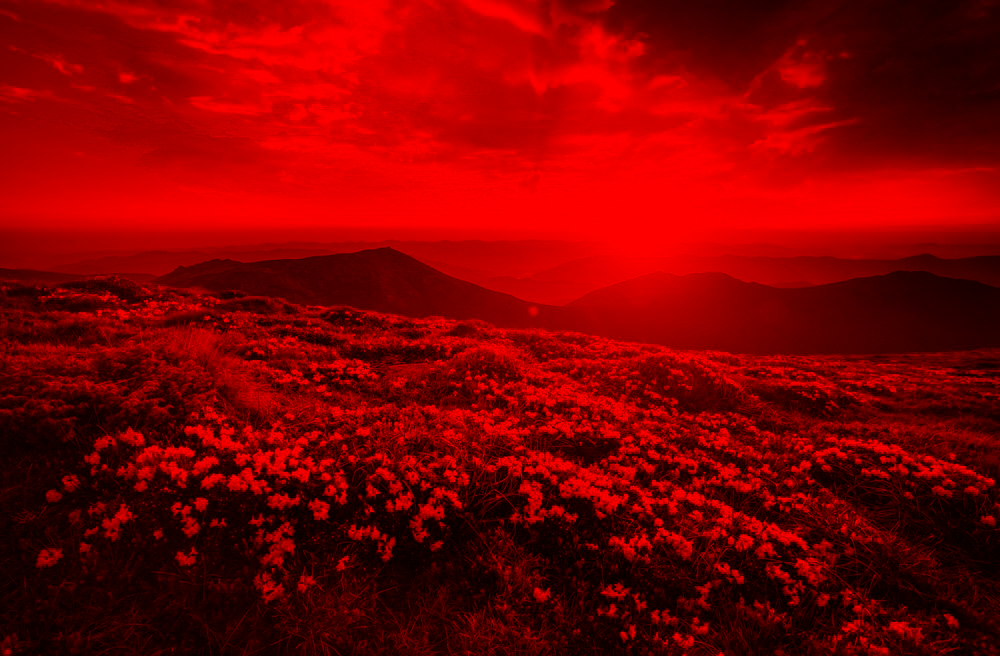
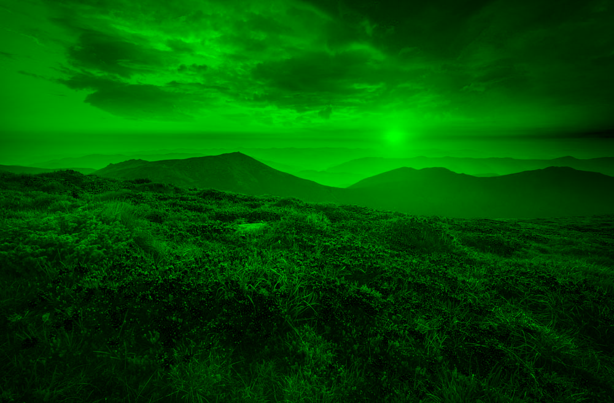
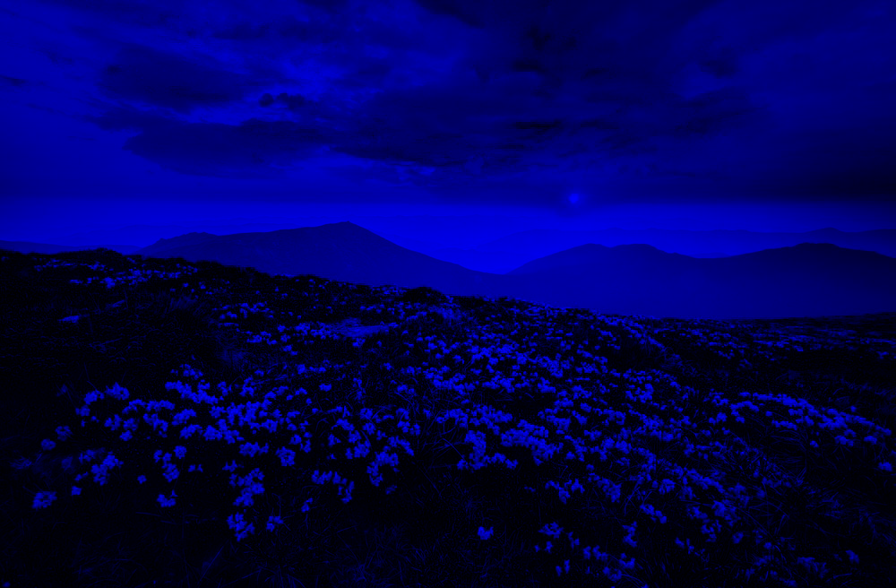
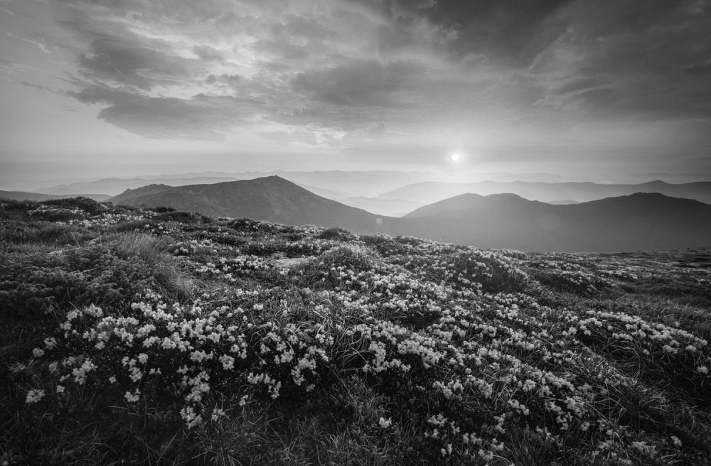
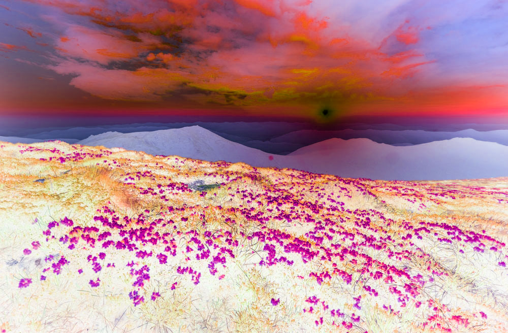

# Лабораторная работа №1
## Цветовые модели и передискретизация изображений

### 1. Цветовые модели

В качестве исходного изображения использован файл `flowers.png` из папки `img`.

**Исходное изображение:**

#### 1.1 Выделение компонент R, G, B

| Красный канал | Зелёный канал | Синий канал |
|---|---|---|
|  |  |  |

#### 1.2 Преобразование в HSI и сохранение яркостной компоненты

Яркостная компонента вычислялась по формуле:

`I = (R + G + B) / 3`

#### 1.3 Инвертирование яркостной компоненты

Для каждого пикселя вычислялась новая яркость:

`I' = 255 - I`

После этого исходные каналы RGB корректировались на изменение яркости.

---

### 2. Передискретизация

#### 2.1 Растяжение изображения в M = 2 раза

Метод: ближайший сосед. Библиотечные функции передискретизации не использовались.

#### 2.2 Сжатие изображения в N = 3 раза

Метод: усреднение по блокам 3 × 3.

#### 2.3 Передискретизация в K = M / N за два прохода

Сначала изображение растягивалось в 2 раза, затем сжималось в 3 раза.

#### 2.4 Передискретизация в K раз за один проход

Коэффициент передискретизации:

`K = 2 / 3 = 0.667`

Метод: обратное отображение координат и ближайший сосед.

