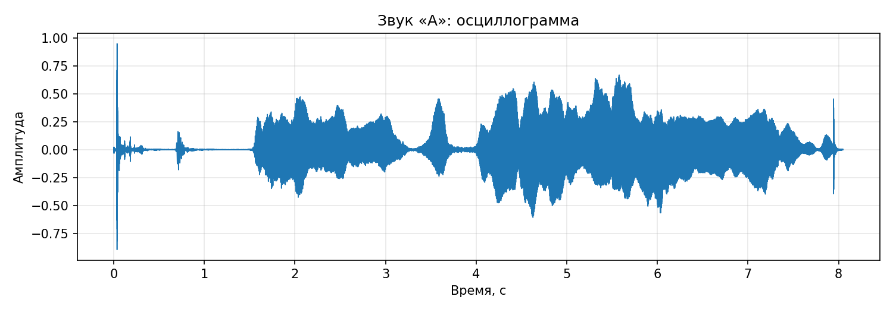
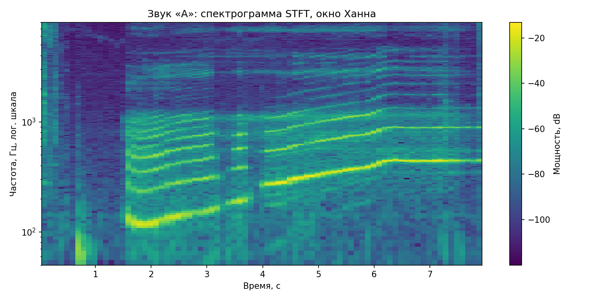
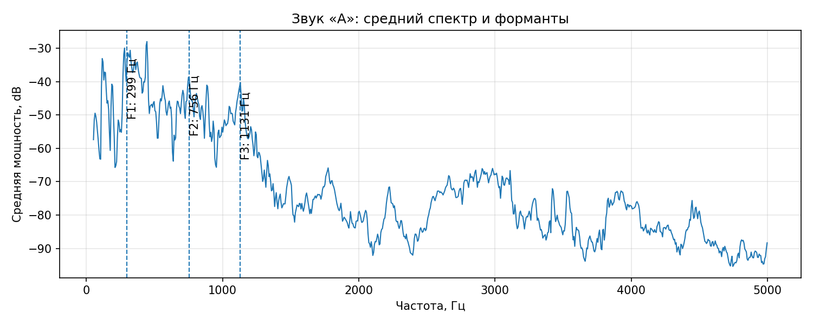
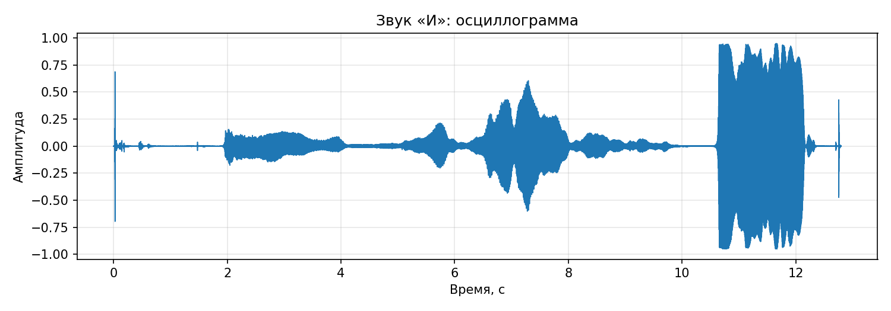
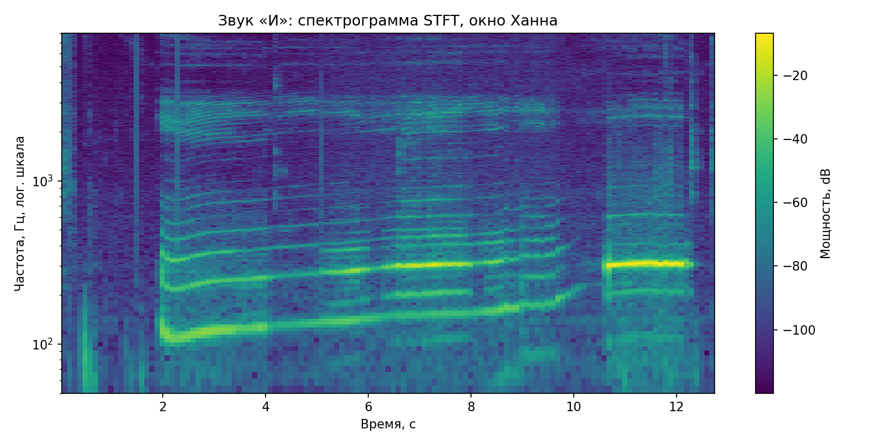
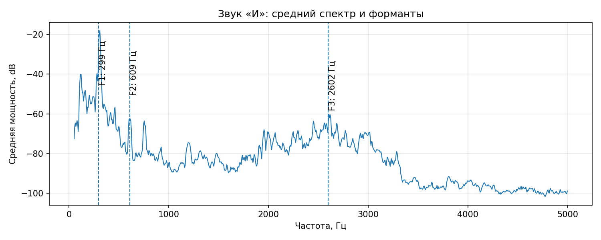
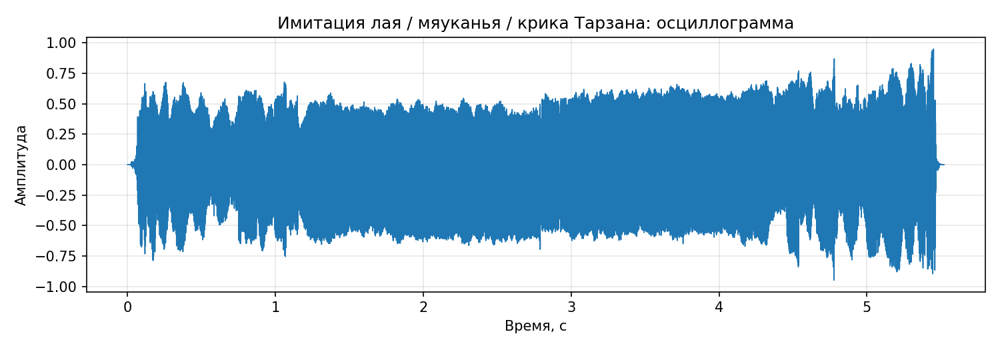
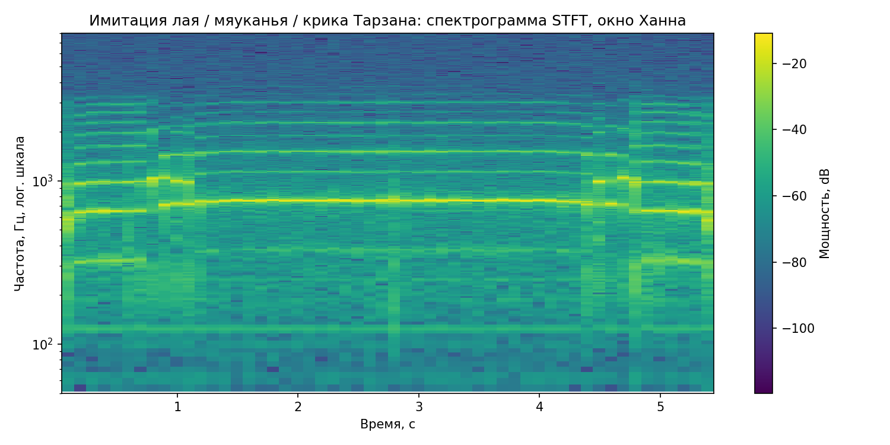
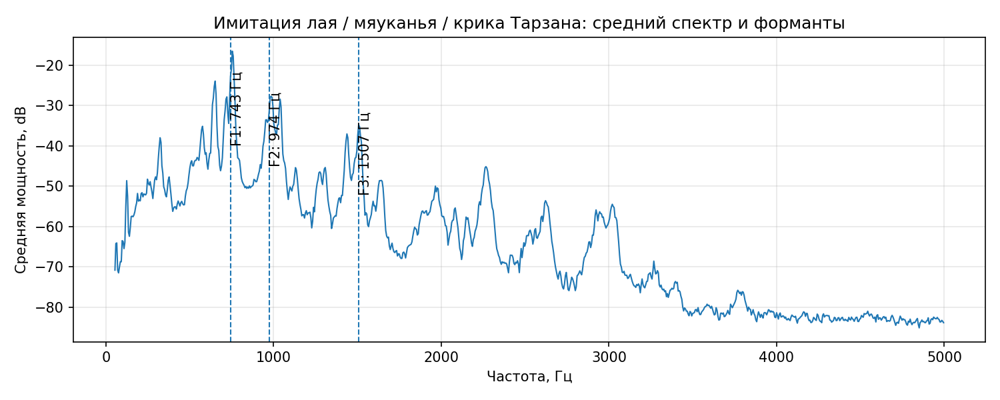

# Лабораторная работа №10. Обработка голоса
## Вариант 1. Голосовой диапазон, тембр, форманты

---

## Используемые методы

Для каждого аудиофайла выполняется перевод в моно, нормализация амплитуды, построение осциллограммы и спектрограммы.

Спектрограмма строится с помощью оконного преобразования Фурье STFT с окном Ханна. Частоты на спектрограмме показаны на логарифмической шкале.

Минимальная и максимальная частота голоса оцениваются по диапазону частот, где средняя энергия заметно превышает уровень фона.

Наиболее тембрально окрашенный основной тон определяется как частота-кандидат, для которой в среднем спектре прослеживается наибольшее количество гармоник-обертонов.

Форманты ищутся как частоты с наибольшей средней энергией в диапазоне 150-3500 Гц после сглаживания в окрестности около 50 Гц.

---

## Исходные аудиозаписи

| Образец | Файл | Частота дискретизации | Длительность |
|---|---|---:|---:|
| Звук «А» | `voice_a.wav` | 48000 Гц | 8.05 с |
| Звук «И» | `voice_i.wav` | 48000 Гц | 12.80 с |
| Имитация лая / мяуканья / крика Тарзана | `imit.wav` | 44100 Гц | 5.52 с |

---

## Сводная таблица результатов

| Образец | Мин. частота | Макс. частота | Основной тон с максимумом обертонов | Кол-во обертонов | Форманта 1 | Форманта 2 | Форманта 3 |
|---|---:|---:|---:|---:|---:|---:|---:|
| Звук «А» | 117.2 Гц | 755.9 Гц | 85.0 Гц | 4 | 298.8 Гц | 755.9 Гц | 1130.9 Гц |
| Звук «И» | 298.8 Гц | 316.4 Гц | 80.0 Гц | 1 | 298.8 Гц | 609.4 Гц | 2601.6 Гц |
| Имитация лая / мяуканья / крика Тарзана | 646.0 Гц | 764.4 Гц | 95.0 Гц | 2 | 742.9 Гц | 974.4 Гц | 1507.3 Гц |

---

## Образец: Звук «А»

**Исходный файл:** `voice_a.wav`  
**Моно-копия:** `./result/a/a_mono.wav`  
**Длительность:** 8.05 с  
**Диапазон частот голоса:** 117.2-755.9 Гц  
**Наиболее тембрально окрашенный основной тон:** 85.0 Гц, найдено обертонов: 4

### Осциллограмма

### Спектрограмма

### Средний спектр и три сильные форманты

| Форманта | Частота | Относительная энергия |
|---:|---:|---:|
| F1 | 298.8 Гц | 5.706765e-04 |
| F2 | 755.9 Гц | 5.939863e-05 |
| F3 | 1130.9 Гц | 4.129233e-05 |

---

## Образец: Звук «И»

**Исходный файл:** `voice_i.wav`  
**Моно-копия:** `./result/i/i_mono.wav`  
**Длительность:** 12.80 с  
**Диапазон частот голоса:** 298.8-316.4 Гц  
**Наиболее тембрально окрашенный основной тон:** 80.0 Гц, найдено обертонов: 1

### Осциллограмма

### Спектрограмма

### Средний спектр и три сильные форманты

| Форманта | Частота | Относительная энергия |
|---:|---:|---:|
| F1 | 298.8 Гц | 3.733838e-03 |
| F2 | 609.4 Гц | 2.793792e-07 |
| F3 | 2601.6 Гц | 4.958983e-07 |

---

## Образец: Имитация лая / мяуканья / крика Тарзана

**Исходный файл:** `imit.wav`  
**Моно-копия:** `./result/imit/imit_mono.wav`  
**Длительность:** 5.52 с  
**Диапазон частот голоса:** 646.0-764.4 Гц  
**Наиболее тембрально окрашенный основной тон:** 95.0 Гц, найдено обертонов: 2

### Осциллограмма

### Спектрограмма

### Средний спектр и три сильные форманты

| Форманта | Частота | Относительная энергия |
|---:|---:|---:|
| F1 | 742.9 Гц | 6.804637e-03 |
| F2 | 974.4 Гц | 9.204414e-04 |
| F3 | 1507.3 Гц | 1.474615e-04 |

---

## Сравнение формант звуков «А» и «И»

Для звука «А» найдены форманты: 299 Гц, 756 Гц, 1131 Гц.

Для звука «И» найдены форманты: 299 Гц, 609 Гц, 2602 Гц.

Форманты различаются, поскольку при произнесении разных гласных изменяется положение языка, губ и резонансные частоты речевого тракта.

---

## Вывод

В ходе работы были построены спектрограммы голосовых записей, оценён частотный диапазон голоса, найден основной тон с наибольшим количеством обертонов и определены три наиболее сильные форманты для каждого звукового образца.
