# Лабораторная работа №2
## Обесцвечивание и бинаризация растровых изображений

**Вариант:** 4

---

## Результаты обработки

### 1. Сравнение исходных цветных и полутоновых изображений

Для каждого примера слева показано исходное цветное изображение, справа — полученное полутоновое изображение.

Для каждого исходного цветного изображения выполнялось взвешенное усреднение каналов:

$$
Y = 0.2126 \cdot R + 0.7152 \cdot G + 0.0722 \cdot B
$$

| **Мультфильм** | |
|:---:|:---:|
| 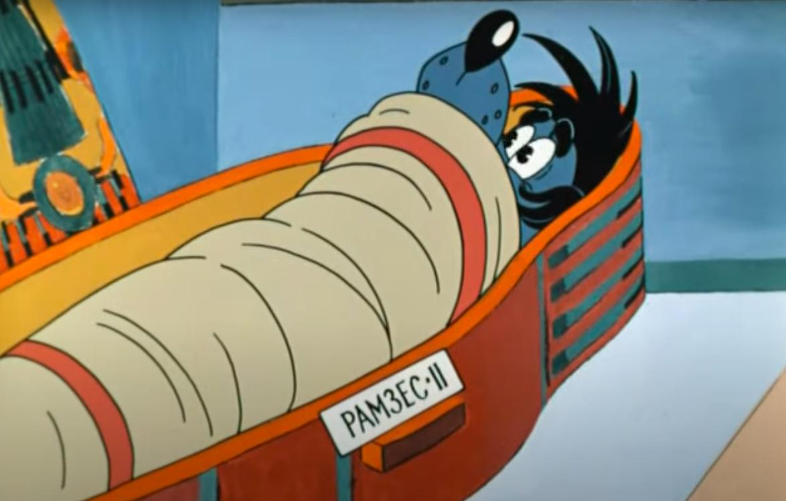 | 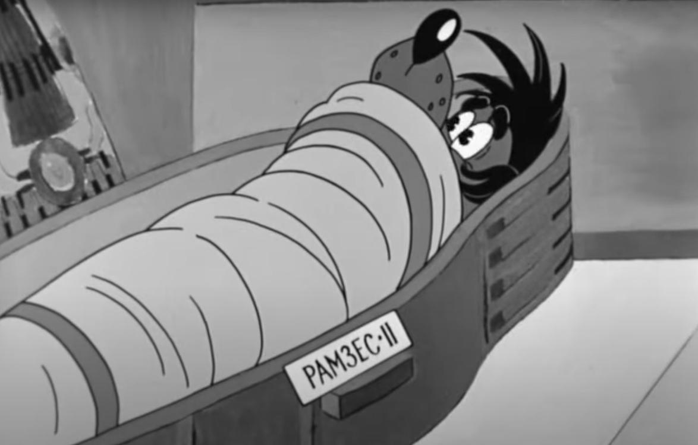 |

| **Рентгеновский снимок** | |
|:---:|:---:|
| 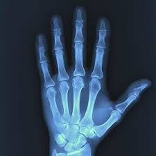 | 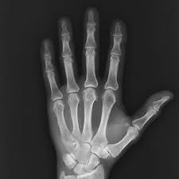 |

| **Контурная карта** | |
|:---:|:---:|
| 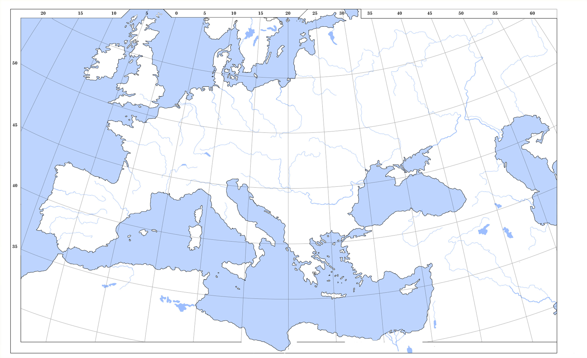 | 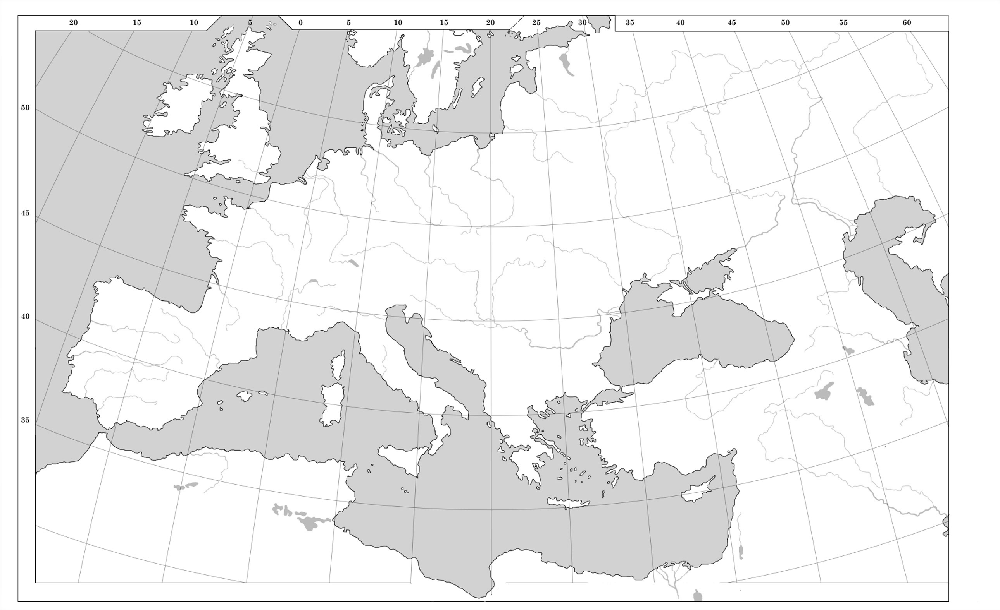 |

| **Текст 1** | |
|:---:|:---:|
|  | 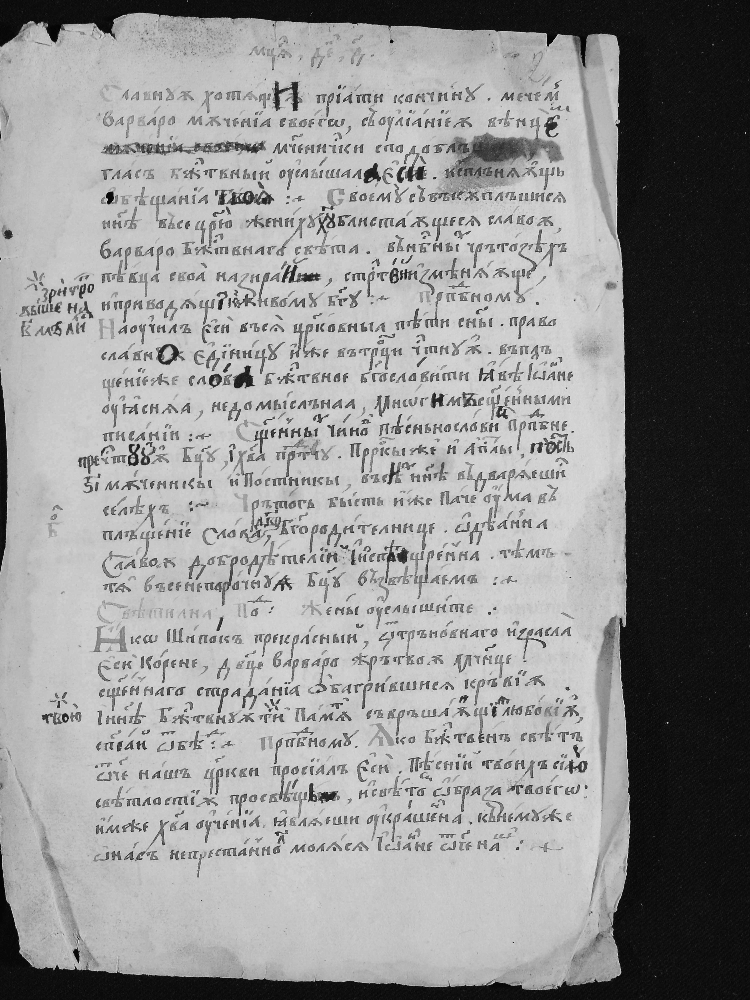 |

| **Текст 2** | |
|:---:|:---:|
|  | 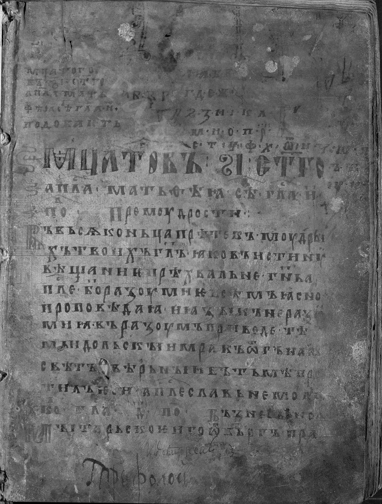 |

---

### 2. Бинаризация изображений методом Брэдли-Рота

Для бинаризации использовался метод Брэдли-Рота. В варианте 4 выполняется обработка с окнами $3 \times 3$ и $25 \times 25$.

Метод основан на вычислении локального среднего значения яркости в окне вокруг текущего пикселя.

Порог вычисляется по формуле:

$$
T(x,y) = m(x,y) \cdot \left(1 - \frac{t}{100}\right)
$$

где:
- $m(x,y)$ — локальное среднее значение яркости в окне;
- $t = 15$% — коэффициент чувствительности метода;
- если яркость пикселя меньше или равна порогу, пиксель становится чёрным;
- иначе пиксель становится белым.

### 2.1. Эксперимент с размером окна для `cartoon`

Для изображения `cartoon` были рассмотрены два размера окна:
- $3 \times 3$
- $25 \times 25$

#### Исходное полутоновое изображение

#### Результаты бинаризации

**Окно $3 \times 3$**

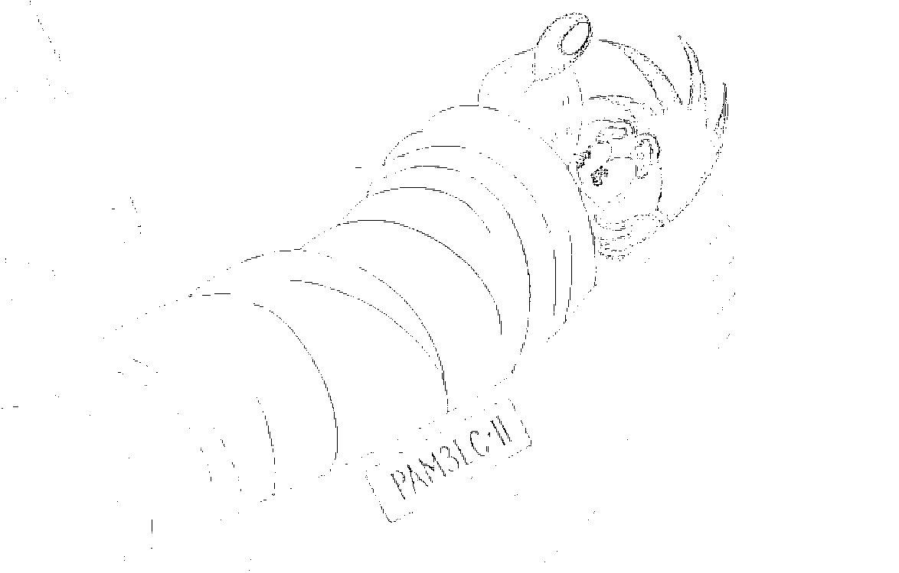

**Окно $25 \times 25$**

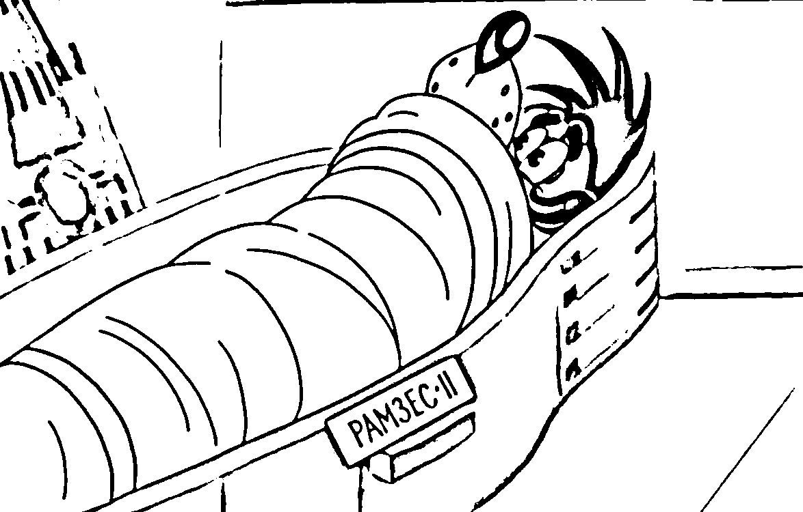

Вывод:
Для cartoon лучше подходит окно $25 \times 25$. Линии силуета не потерялись и образ читаем.

---

### 2.2. Эксперимент с размером окна для `xray`

Для изображения `xray` были рассмотрены два размера окна:
- $3 \times 3$
- $25 \times 25$

#### Исходное полутоновое изображение

#### Результаты бинаризации

**Окно $3 \times 3$**

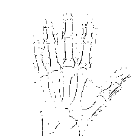

**Окно $25 \times 25$**

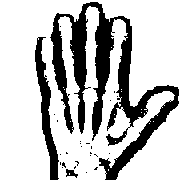

Вывод:
Для xray результат слабый. Окно $3 \times 3$ как и в случае с мультком потеряли целостность. А окно $25 \times 25$ увеличило все линии и потерло внутренние детали.

---

### 2.3. Эксперимент с размером окна для `map`

Для изображения `map` были рассмотрены два размера окна:
- $3 \times 3$
- $25 \times 25$

#### Исходное полутоновое изображение

#### Результаты бинаризации

**Окно $3 \times 3$**

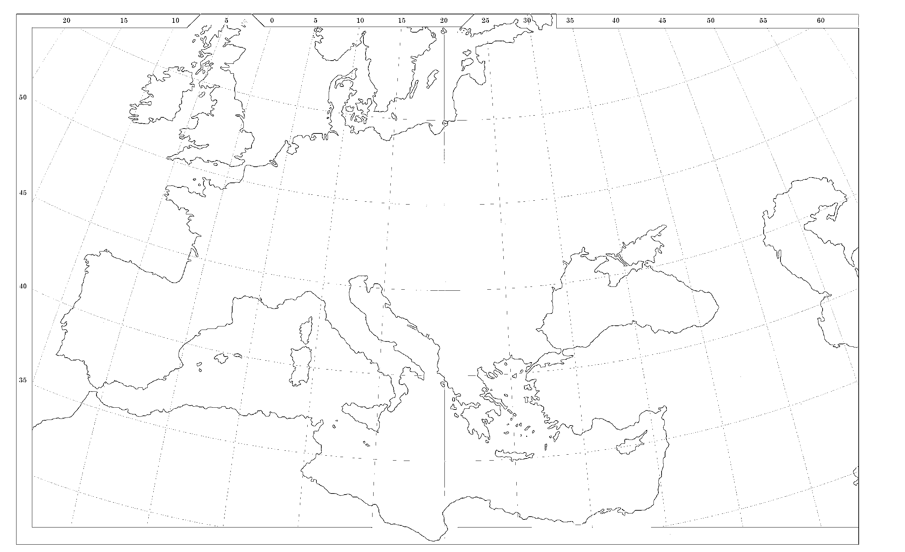

**Окно $25 \times 25$**

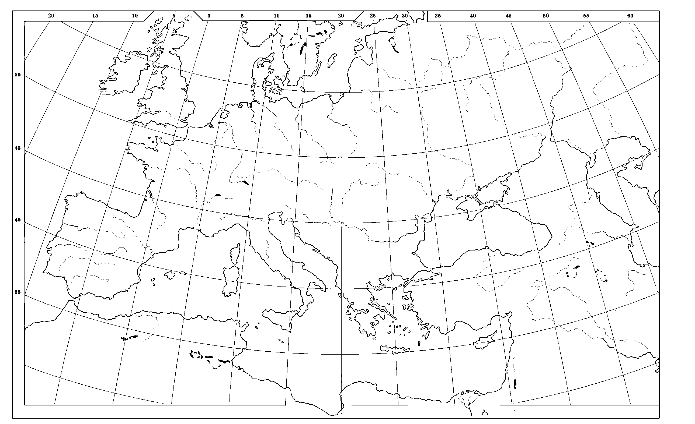

Вывод:
Для map показало себя хорошо.  Окно $3 \times 3$ избавилось от меридианы и широты, а контур берегов остались. А окно $25 \times 25$ наоборот усилило все линии и стало легче понимать пересечение стран с меридианами и широтами.

---

### 2.4. Эксперимент с размером окна для `text1`

Для изображения `text1` были рассмотрены два размера окна:
- $3 \times 3$
- $25 \times 25$

#### Исходное полутоновое изображение

#### Результаты бинаризации

**Окно $3 \times 3$**

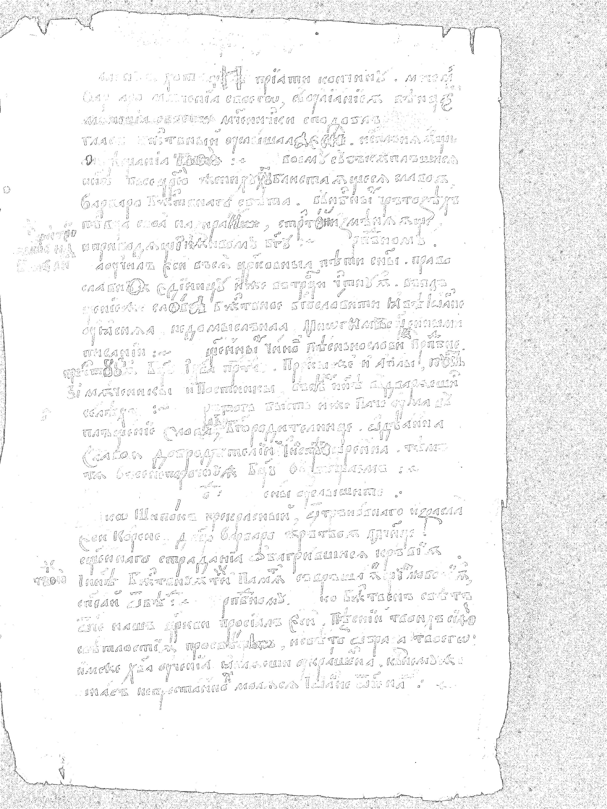

**Окно $25 \times 25$**

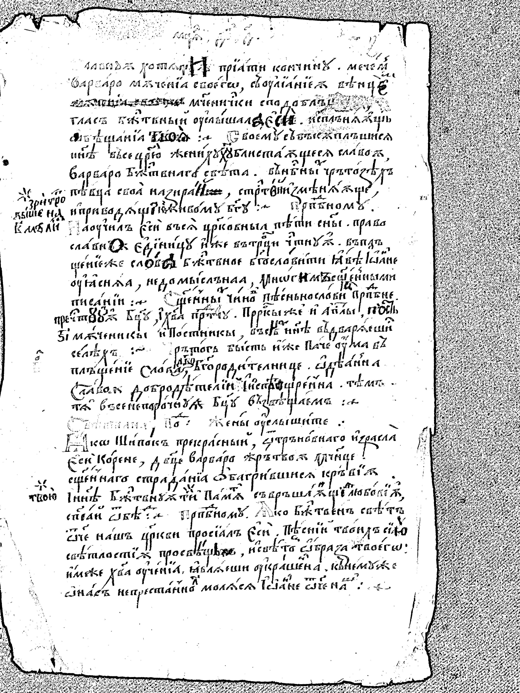

Вывод:
Для text1 окно $25 \times 25$ отработало неодназначно: текст местами стал более читаемый, а в других потерялся.

---

### 2.5. Эксперимент с размером окна для `text2`

Для изображения `text2` были рассмотрены два размера окна:
- $3 \times 3$
- $25 \times 25$

#### Исходное полутоновое изображение

#### Результаты бинаризации

**Окно $3 \times 3$**

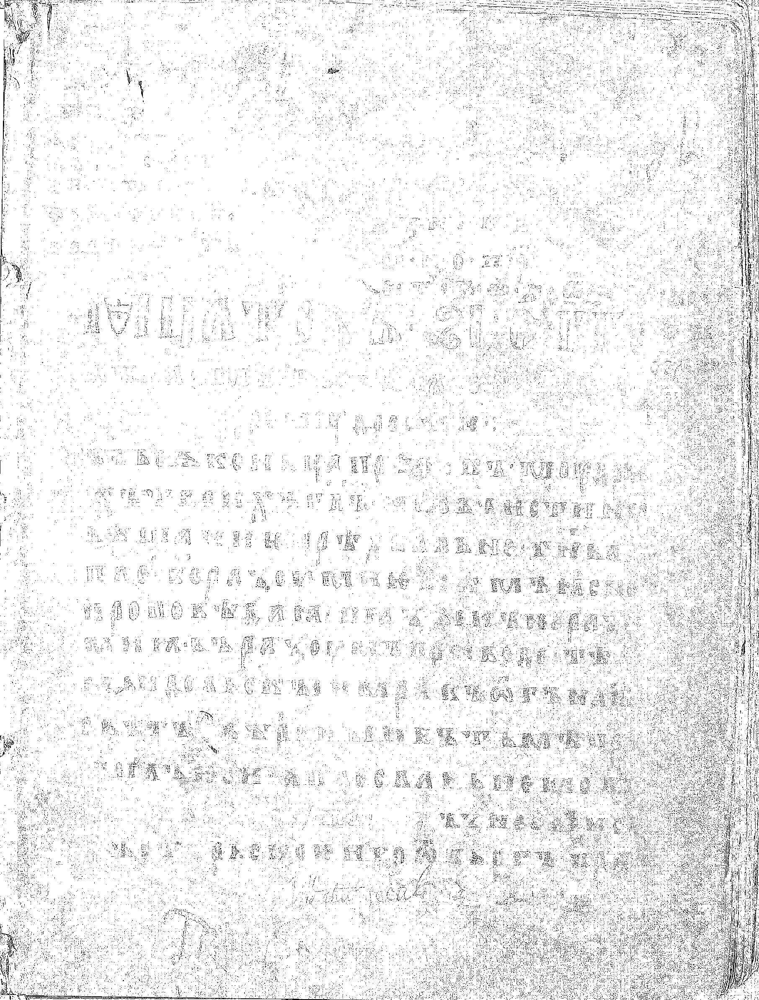

**Окно $25 \times 25$**

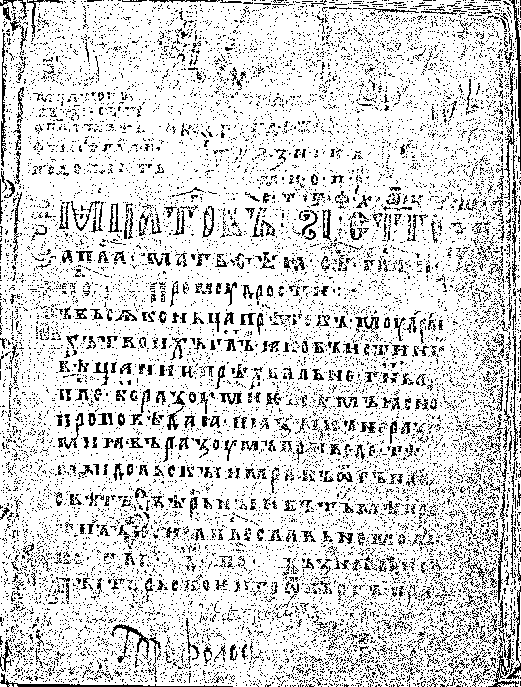

Вывод:
Для text2 оба окна отработали плохо. Повысилась зернистоть и текст стал почти нечитаем.

---
