# Лабораторная работа №5. Выделение признаков символов

**Вариант:** 4  
**Алфавит:** Кириллица заглавная  
**Символы алфавита:** А Б В Г Д Е Ж Ѕ З И I К Л М Н О П Р С Т Ѹ Ф Х Ц Ч Ш Щ Ъ Ы Ь Ѣ Ю Ѵ Ѯ Ѱ Ѡ Ѳ Ѧ Ѫ  
**Шрифт:** MonomakhUnicode.otf  
**Кегль:** 52  

Скалярные характеристики символов автоматически получены программой и экспортированы из файла `scalara.csv`.  
Изображения символов берутся из папки `symbols`, графики профилей — из папки `profiles`.

---

## Символ 1 — А

### Изображение символа

### Скалярные характеристики

| Признак | Значение |
|---|---:|
| Ширина изображения | 30 |
| Высота изображения | 36 |
| Общий вес чёрного | 522 |
| Общий удельный вес | 0.483333 |
| Вес 1-й четверти | 71 |
| Вес 2-й четверти | 179 |
| Вес 3-й четверти | 118 |
| Вес 4-й четверти | 154 |
| Удельный вес 1-й четверти | 0.262963 |
| Удельный вес 2-й четверти | 0.662963 |
| Удельный вес 3-й четверти | 0.437037 |
| Удельный вес 4-й четверти | 0.570370 |
| Координата центра тяжести X | 16.365900 |
| Координата центра тяжести Y | 18.295019 |
| Нормированная координата X | 0.564341 |
| Нормированная координата Y | 0.522715 |
| Осевой момент инерции Ix | 56472.567050 |
| Осевой момент инерции Iy | 35455.113027 |
| Нормированный момент инерции Ix | 0.048416 |
| Нормированный момент инерции Iy | 0.030397 |

### Профиль X

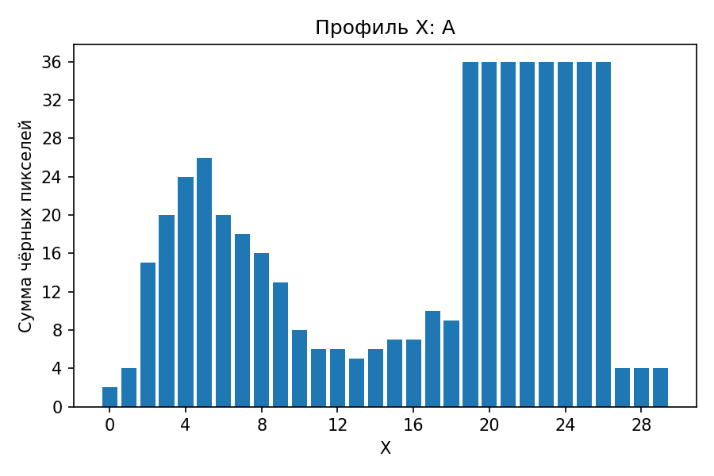

### Профиль Y

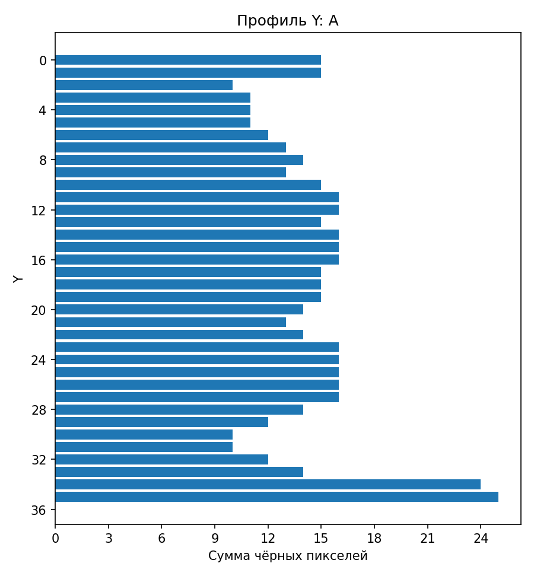

---
## Символ 2 — Б

### Изображение символа

### Скалярные характеристики

| Признак | Значение |
|---|---:|
| Ширина изображения | 27 |
| Высота изображения | 36 |
| Общий вес чёрного | 537 |
| Общий удельный вес | 0.552469 |
| Вес 1-й четверти | 158 |
| Вес 2-й четверти | 65 |
| Вес 3-й четверти | 155 |
| Вес 4-й четверти | 159 |
| Удельный вес 1-й четверти | 0.675214 |
| Удельный вес 2-й четверти | 0.257937 |
| Удельный вес 3-й четверти | 0.662393 |
| Удельный вес 4-й четверти | 0.630952 |
| Координата центра тяжести X | 12.603352 |
| Координата центра тяжести Y | 18.584730 |
| Нормированная координата X | 0.484744 |
| Нормированная координата Y | 0.530992 |
| Осевой момент инерции Ix | 69126.394786 |
| Осевой момент инерции Iy | 32572.513966 |
| Нормированный момент инерции Ix | 0.073166 |
| Нормированный момент инерции Iy | 0.034476 |

### Профиль X

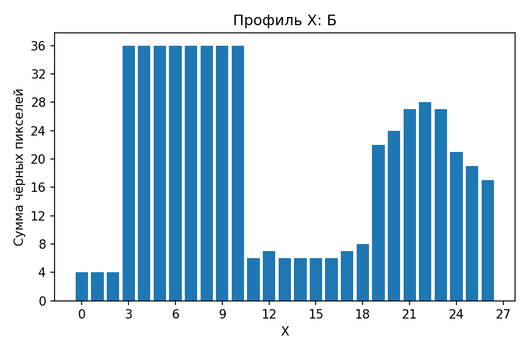

### Профиль Y

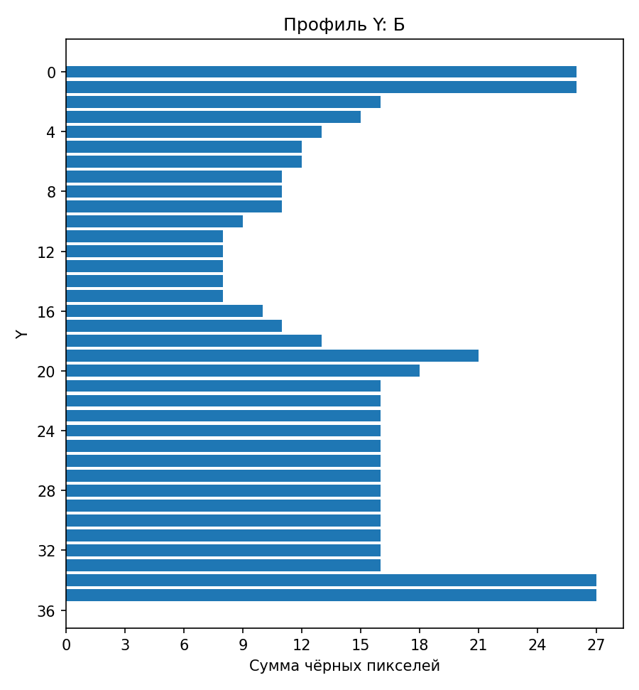

---
## Символ 3 — В

### Изображение символа

### Скалярные характеристики

| Признак | Значение |
|---|---:|
| Ширина изображения | 26 |
| Высота изображения | 37 |
| Общий вес чёрного | 552 |
| Общий удельный вес | 0.573805 |
| Вес 1-й четверти | 125 |
| Вес 2-й четверти | 120 |
| Вес 3-й четверти | 169 |
| Вес 4-й четверти | 138 |
| Удельный вес 1-й четверти | 0.534188 |
| Удельный вес 2-й четверти | 0.512821 |
| Удельный вес 3-й четверти | 0.684211 |
| Удельный вес 4-й четверти | 0.558704 |
| Координата центра тяжести X | 12.818841 |
| Координата центра тяжести Y | 19.463768 |
| Нормированная координата X | 0.512754 |
| Нормированная координата Y | 0.540660 |
| Осевой момент инерции Ix | 62947.275362 |
| Осевой момент инерции Iy | 32411.884058 |
| Нормированный момент инерции Ix | 0.068018 |
| Нормированный момент инерции Iy | 0.035023 |

### Профиль X

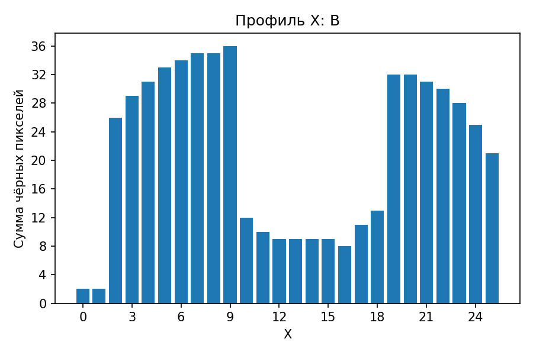

### Профиль Y

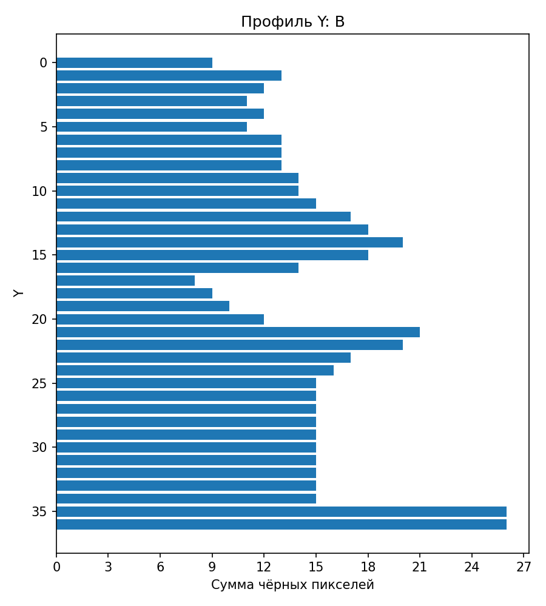

---
## Символ 4 — Г

### Изображение символа

### Скалярные характеристики

| Признак | Значение |
|---|---:|
| Ширина изображения | 26 |
| Высота изображения | 36 |
| Общий вес чёрного | 383 |
| Общий удельный вес | 0.409188 |
| Вес 1-й четверти | 154 |
| Вес 2-й четверти | 75 |
| Вес 3-й четверти | 154 |
| Вес 4-й четверти | 0 |
| Удельный вес 1-й четверти | 0.658120 |
| Удельный вес 2-й четверти | 0.320513 |
| Удельный вес 3-й четверти | 0.658120 |
| Удельный вес 4-й четверти | 0.000000 |
| Координата центра тяжести X | 9.172324 |
| Координата центра тяжести Y | 14.780679 |
| Нормированная координата X | 0.366893 |
| Нормированная координата Y | 0.422305 |
| Осевой момент инерции Ix | 49259.577023 |
| Осевой момент инерции Iy | 14664.626632 |
| Нормированный момент инерции Ix | 0.056226 |
| Нормированный момент инерции Iy | 0.016739 |

### Профиль X

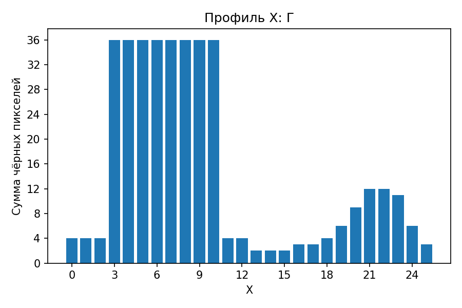

### Профиль Y

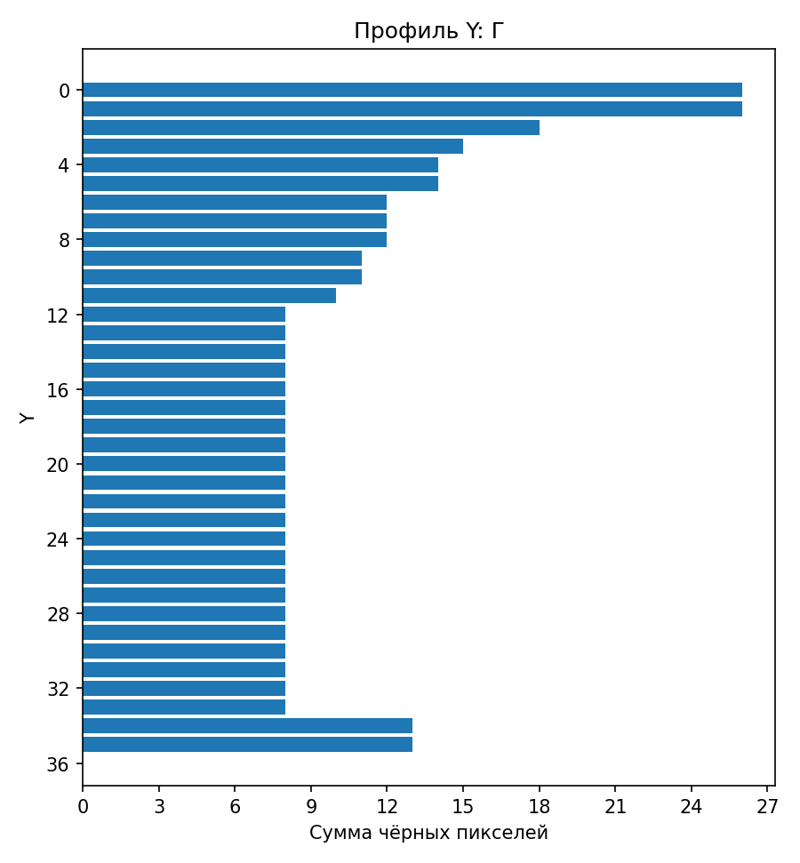

---
## Символ 5 — Д

### Изображение символа

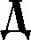

### Скалярные характеристики

| Признак | Значение |
|---|---:|
| Ширина изображения | 35 |
| Высота изображения | 45 |
| Общий вес чёрного | 507 |
| Общий удельный вес | 0.321905 |
| Вес 1-й четверти | 69 |
| Вес 2-й четверти | 155 |
| Вес 3-й четверти | 107 |
| Вес 4-й четверти | 176 |
| Удельный вес 1-й четверти | 0.184492 |
| Удельный вес 2-й четверти | 0.391414 |
| Удельный вес 3-й четверти | 0.273657 |
| Удельный вес 4-й четверти | 0.425121 |
| Координата центра тяжести X | 18.280079 |
| Координата центра тяжести Y | 22.913215 |
| Нормированная координата X | 0.537649 |
| Нормированная координата Y | 0.520755 |
| Осевой момент инерции Ix | 82174.181460 |
| Осевой момент инерции Iy | 31704.228797 |
| Нормированный момент инерции Ix | 0.033126 |
| Нормированный момент инерции Iy | 0.012781 |

### Профиль X

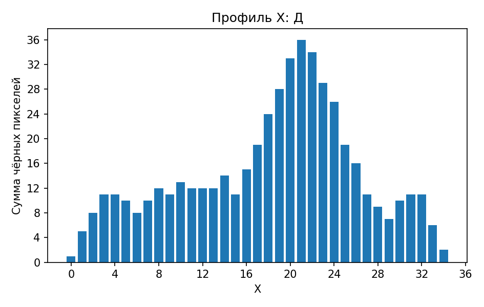

### Профиль Y

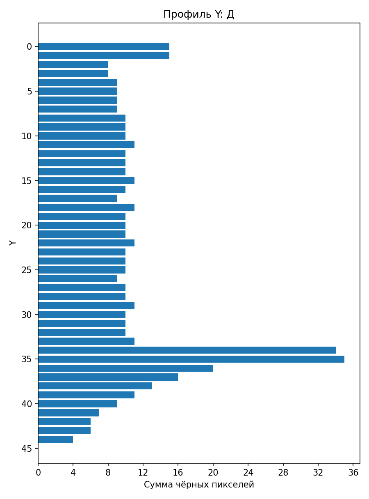

---
## Символ 6 — Е

### Изображение символа

### Скалярные характеристики

| Признак | Значение |
|---|---:|
| Ширина изображения | 29 |
| Высота изображения | 38 |
| Общий вес чёрного | 498 |
| Общий удельный вес | 0.451906 |
| Вес 1-й четверти | 135 |
| Вес 2-й четверти | 128 |
| Вес 3-й четверти | 126 |
| Вес 4-й четверти | 109 |
| Удельный вес 1-й четверти | 0.507519 |
| Удельный вес 2-й четверти | 0.449123 |
| Удельный вес 3-й четверти | 0.473684 |
| Удельный вес 4-й четверти | 0.382456 |
| Координата центра тяжести X | 12.658635 |
| Координата центра тяжести Y | 18.401606 |
| Нормированная координата X | 0.452094 |
| Нормированная координата Y | 0.497341 |
| Осевой момент инерции Ix | 54821.678715 |
| Осевой момент инерции Iy | 35643.967871 |
| Нормированный момент инерции Ix | 0.045143 |
| Нормированный момент инерции Iy | 0.029351 |

### Профиль X

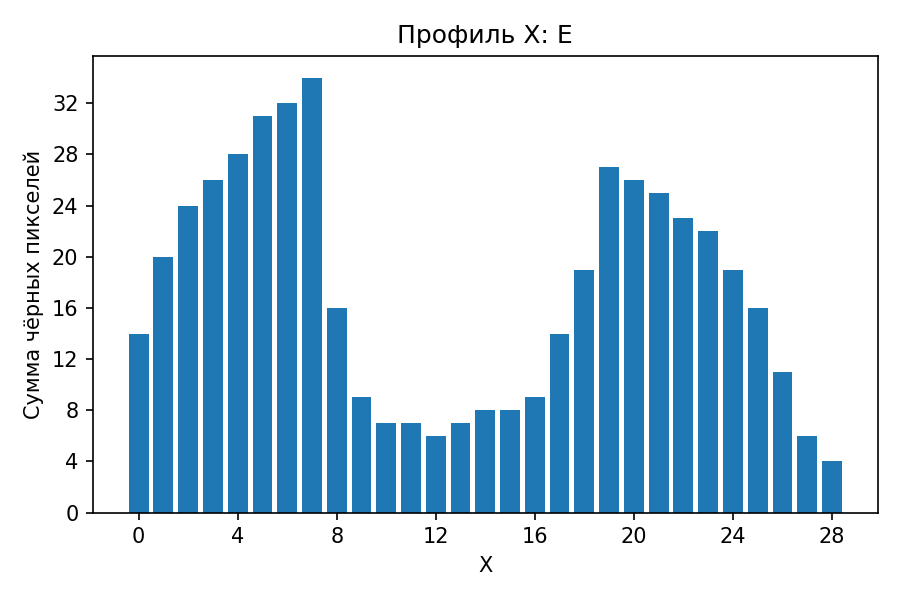

### Профиль Y

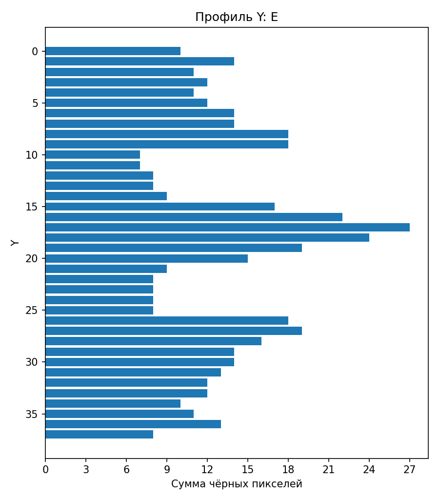

---
## Символ 7 — Ж

### Изображение символа

### Скалярные характеристики

| Признак | Значение |
|---|---:|
| Ширина изображения | 46 |
| Высота изображения | 37 |
| Общий вес чёрного | 788 |
| Общий удельный вес | 0.462985 |
| Вес 1-й четверти | 172 |
| Вес 2-й четверти | 176 |
| Вес 3-й четверти | 217 |
| Вес 4-й четверти | 223 |
| Удельный вес 1-й четверти | 0.415459 |
| Удельный вес 2-й четверти | 0.425121 |
| Удельный вес 3-й четверти | 0.496568 |
| Удельный вес 4-й четверти | 0.510297 |
| Координата центра тяжести X | 22.727157 |
| Координата центра тяжести Y | 18.927665 |
| Нормированная координата X | 0.505048 |
| Нормированная координата Y | 0.525768 |
| Осевой момент инерции Ix | 107122.876904 |
| Осевой момент инерции Iy | 114796.338832 |
| Нормированный момент инерции Ix | 0.036980 |
| Нормированный момент инерции Iy | 0.039629 |

### Профиль X

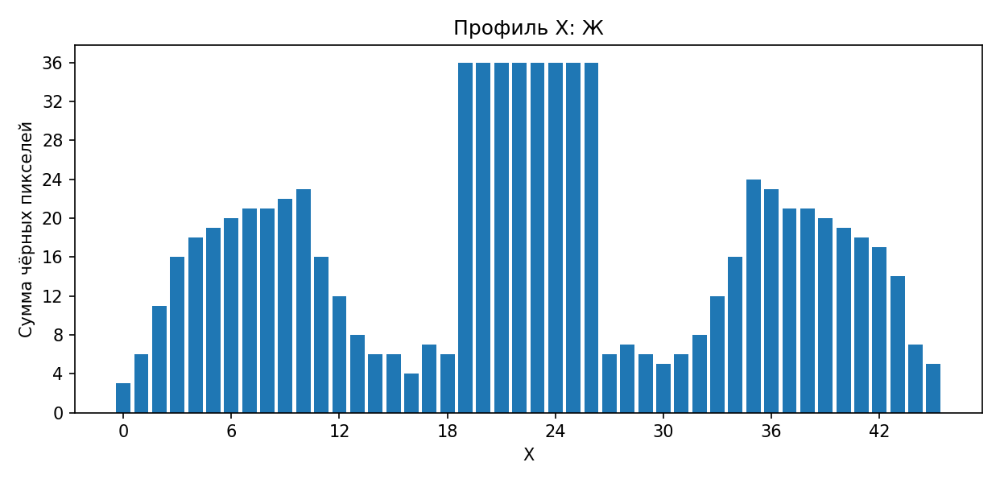

### Профиль Y

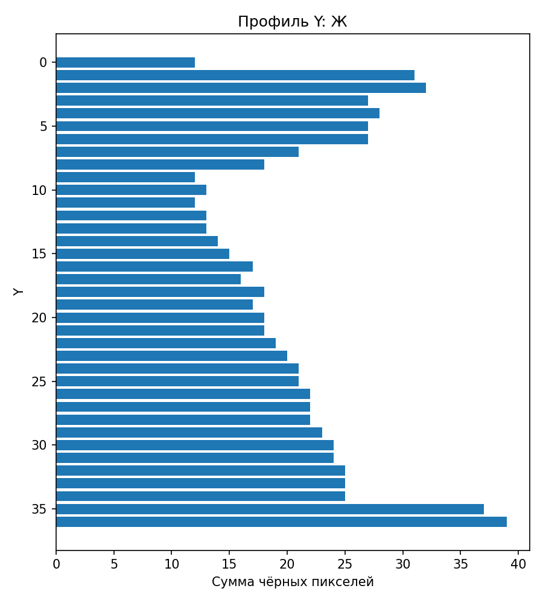

---
## Символ 8 — Ѕ

### Изображение символа

### Скалярные характеристики

| Признак | Значение |
|---|---:|
| Ширина изображения | 33 |
| Высота изображения | 39 |
| Общий вес чёрного | 506 |
| Общий удельный вес | 0.393162 |
| Вес 1-й четверти | 143 |
| Вес 2-й четверти | 95 |
| Вес 3-й четверти | 88 |
| Вес 4-й четверти | 180 |
| Удельный вес 1-й четверти | 0.470395 |
| Удельный вес 2-й четверти | 0.294118 |
| Удельный вес 3-й четверти | 0.275000 |
| Удельный вес 4-й четверти | 0.529412 |
| Координата центра тяжести X | 17.754941 |
| Координата центра тяжести Y | 19.812253 |
| Нормированная координата X | 0.554842 |
| Нормированная координата Y | 0.521375 |
| Осевой момент инерции Ix | 73775.164032 |
| Осевой момент инерции Iy | 39227.612648 |
| Нормированный момент инерции Ix | 0.044540 |
| Нормированный момент инерции Iy | 0.023683 |

### Профиль X

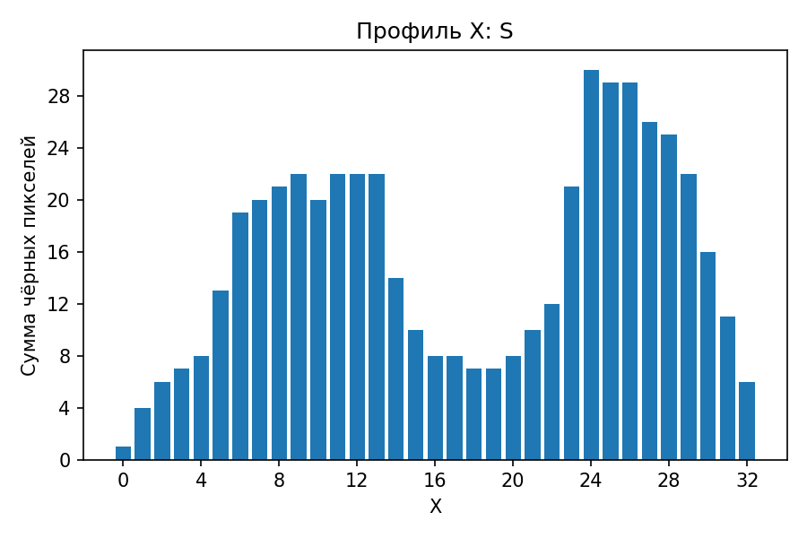

### Профиль Y

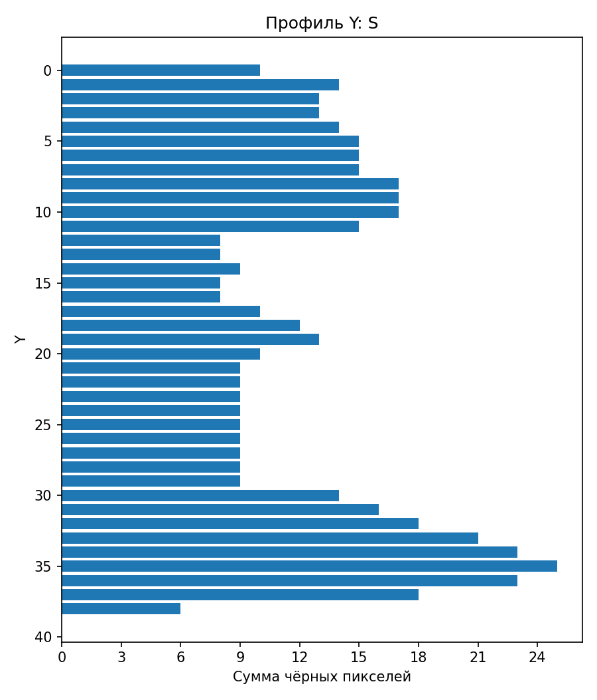

---
## Символ 9 — З

### Изображение символа

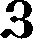

### Скалярные характеристики

| Признак | Значение |
|---|---:|
| Ширина изображения | 33 |
| Высота изображения | 39 |
| Общий вес чёрного | 505 |
| Общий удельный вес | 0.392385 |
| Вес 1-й четверти | 91 |
| Вес 2-й четверти | 142 |
| Вес 3-й четверти | 102 |
| Вес 4-й четверти | 170 |
| Удельный вес 1-й четверти | 0.299342 |
| Удельный вес 2-й четверти | 0.439628 |
| Удельный вес 3-й четверти | 0.318750 |
| Удельный вес 4-й четверти | 0.500000 |
| Координата центра тяжести X | 19.279208 |
| Координата центра тяжести Y | 19.742574 |
| Нормированная координата X | 0.602475 |
| Нормированная координата Y | 0.519541 |
| Осевой момент инерции Ix | 70336.534653 |
| Осевой момент инерции Iy | 37453.631683 |
| Нормированный момент инерции Ix | 0.042464 |
| Нормированный момент инерции Iy | 0.022612 |

### Профиль X

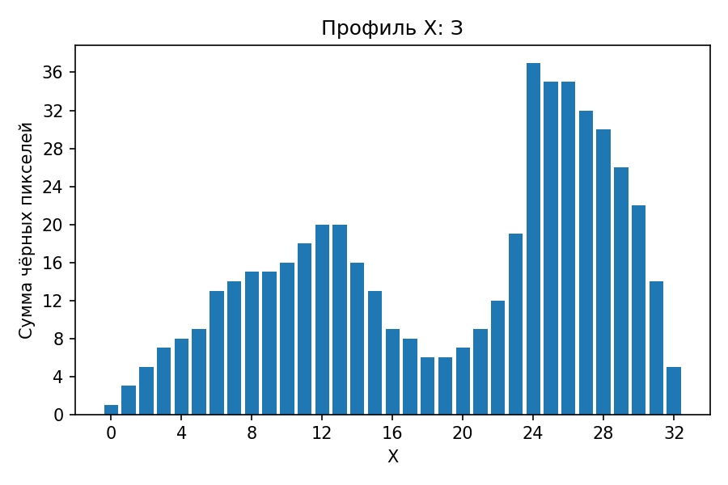

### Профиль Y

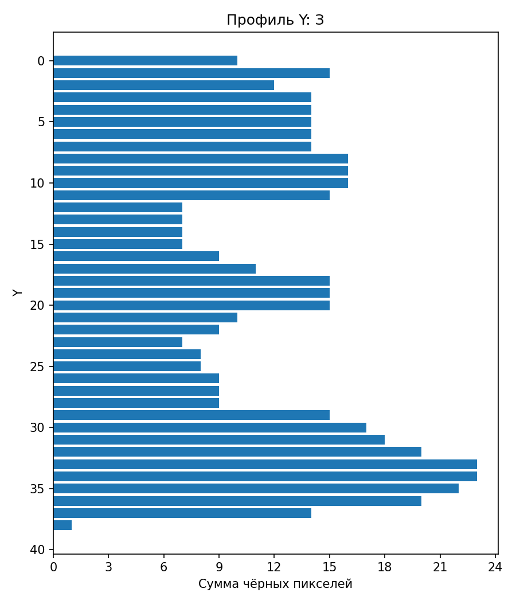

---
## Символ 10 — И

### Изображение символа

### Скалярные характеристики

| Признак | Значение |
|---|---:|
| Ширина изображения | 32 |
| Высота изображения | 36 |
| Общий вес чёрного | 662 |
| Общий удельный вес | 0.574653 |
| Вес 1-й четверти | 155 |
| Вес 2-й четверти | 178 |
| Вес 3-й четверти | 174 |
| Вес 4-й четверти | 155 |
| Удельный вес 1-й четверти | 0.538194 |
| Удельный вес 2-й четверти | 0.618056 |
| Удельный вес 3-й четверти | 0.604167 |
| Удельный вес 4-й четверти | 0.538194 |
| Координата центра тяжести X | 15.916918 |
| Координата центра тяжести Y | 17.453172 |
| Нормированная координата X | 0.513449 |
| Нормированная координата Y | 0.498662 |
| Осевой момент инерции Ix | 74578.048338 |
| Осевой момент инерции Iy | 60240.430514 |
| Нормированный момент инерции Ix | 0.056196 |
| Нормированный момент инерции Iy | 0.045392 |

### Профиль X

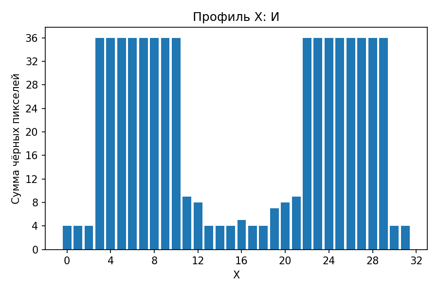

### Профиль Y

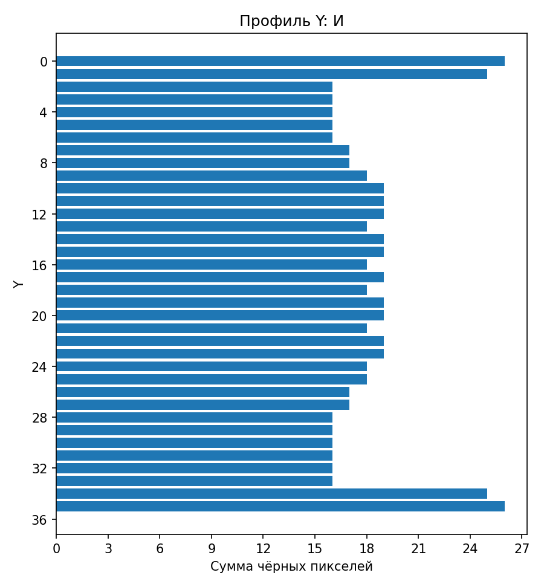

---
## Символ 11 — I

### Изображение символа

### Скалярные характеристики

| Признак | Значение |
|---|---:|
| Ширина изображения | 13 |
| Высота изображения | 36 |
| Общий вес чёрного | 308 |
| Общий удельный вес | 0.658120 |
| Вес 1-й четверти | 60 |
| Вес 2-й четверти | 94 |
| Вес 3-й четверти | 60 |
| Вес 4-й четверти | 94 |
| Удельный вес 1-й четверти | 0.555556 |
| Удельный вес 2-й четверти | 0.746032 |
| Удельный вес 3-й четверти | 0.555556 |
| Удельный вес 4-й четверти | 0.746032 |
| Координата центра тяжести X | 6.415584 |
| Координата центра тяжести Y | 17.500000 |
| Нормированная координата X | 0.534632 |
| Нормированная координата Y | 0.500000 |
| Осевой момент инерции Ix | 36865.000000 |
| Осевой момент инерции Iy | 2082.805195 |
| Нормированный момент инерции Ix | 0.168315 |
| Нормированный момент инерции Iy | 0.009509 |

### Профиль X

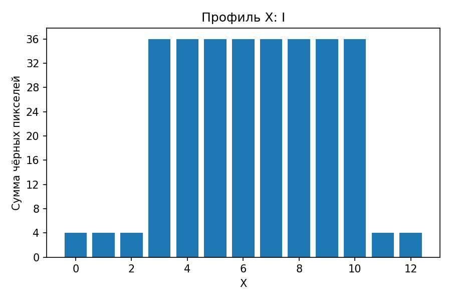

### Профиль Y

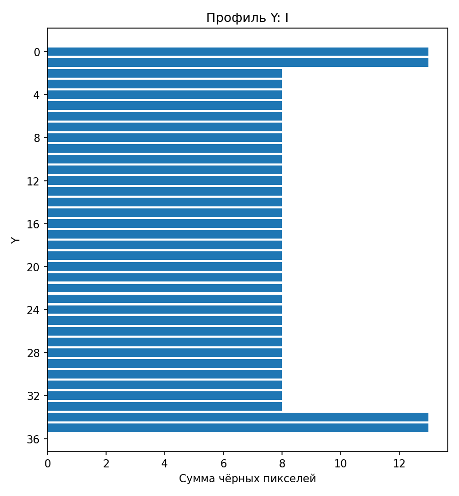

---
## Символ 12 — К

### Изображение символа

### Скалярные характеристики

| Признак | Значение |
|---|---:|
| Ширина изображения | 31 |
| Высота изображения | 36 |
| Общий вес чёрного | 610 |
| Общий удельный вес | 0.546595 |
| Вес 1-й четверти | 162 |
| Вес 2-й четверти | 131 |
| Вес 3-й четверти | 154 |
| Вес 4-й четверти | 163 |
| Удельный вес 1-й четверти | 0.600000 |
| Удельный вес 2-й четверти | 0.454861 |
| Удельный вес 3-й четверти | 0.570370 |
| Удельный вес 4-й четверти | 0.565972 |
| Координата центра тяжести X | 14.239344 |
| Координата центра тяжести Y | 17.834426 |
| Нормированная координата X | 0.474645 |
| Нормированная координата Y | 0.509555 |
| Осевой момент инерции Ix | 74644.277049 |
| Осевой момент инерции Iy | 43873.055738 |
| Нормированный момент инерции Ix | 0.059933 |
| Нормированный момент инерции Iy | 0.035226 |

### Профиль X

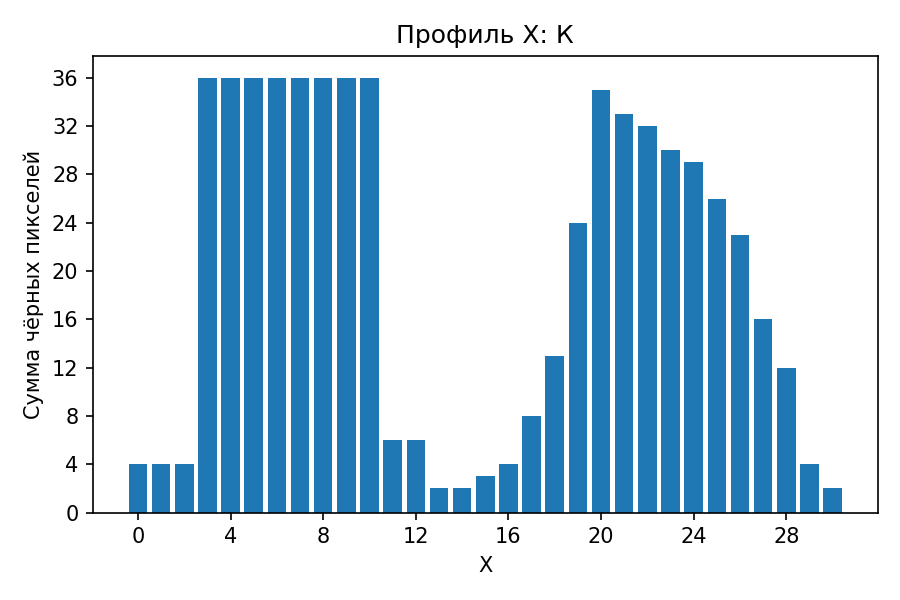

### Профиль Y

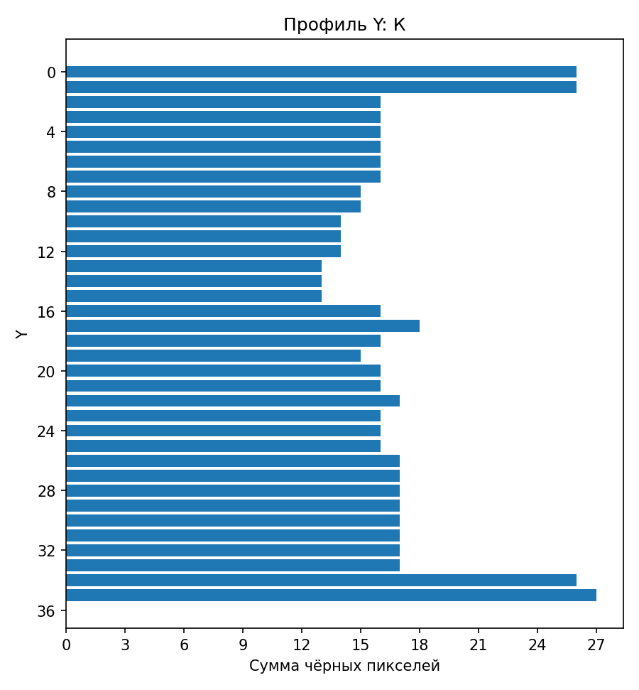

---
## Символ 13 — Л

### Изображение символа

### Скалярные характеристики

| Признак | Значение |
|---|---:|
| Ширина изображения | 30 |
| Высота изображения | 36 |
| Общий вес чёрного | 489 |
| Общий удельный вес | 0.452778 |
| Вес 1-й четверти | 43 |
| Вес 2-й четверти | 153 |
| Вес 3-й четверти | 145 |
| Вес 4-й четверти | 148 |
| Удельный вес 1-й четверти | 0.159259 |
| Удельный вес 2-й четверти | 0.566667 |
| Удельный вес 3-й четверти | 0.537037 |
| Удельный вес 4-й четверти | 0.548148 |
| Координата центра тяжести X | 15.521472 |
| Координата центра тяжести Y | 19.926380 |
| Нормированная координата X | 0.535223 |
| Нормированная координата Y | 0.569325 |
| Осевой момент инерции Ix | 52843.349693 |
| Осевой момент инерции Iy | 26780.024540 |
| Нормированный момент инерции Ix | 0.045305 |
| Нормированный момент инерции Iy | 0.022960 |

### Профиль X

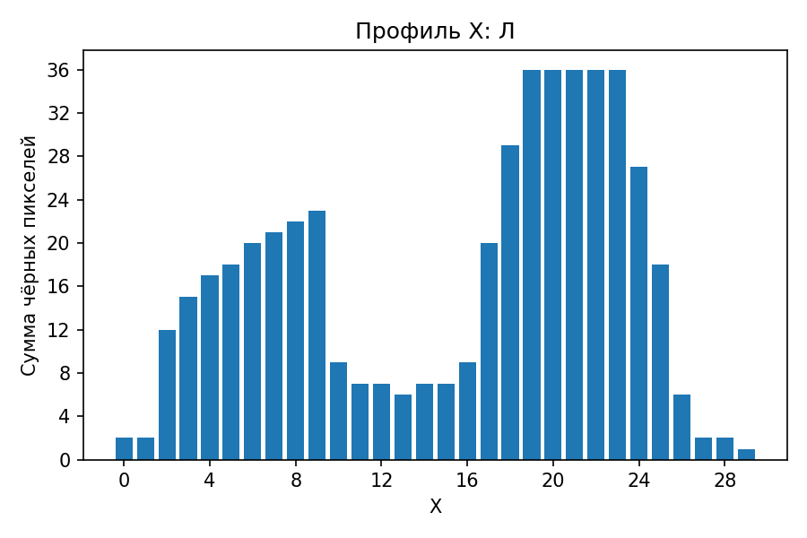

### Профиль Y

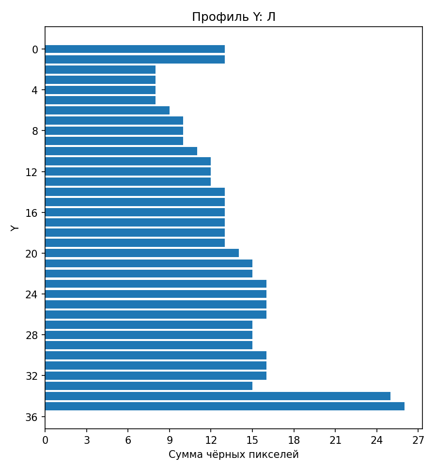

---
## Символ 14 — М

### Изображение символа

### Скалярные характеристики

| Признак | Значение |
|---|---:|
| Ширина изображения | 47 |
| Высота изображения | 36 |
| Общий вес чёрного | 831 |
| Общий удельный вес | 0.491135 |
| Вес 1-й четверти | 175 |
| Вес 2-й четверти | 194 |
| Вес 3-й четверти | 240 |
| Вес 4-й четверти | 222 |
| Удельный вес 1-й четверти | 0.422705 |
| Удельный вес 2-й четверти | 0.449074 |
| Удельный вес 3-й четверти | 0.579710 |
| Удельный вес 4-й четверти | 0.513889 |
| Координата центра тяжести X | 24.397112 |
| Координата центра тяжести Y | 18.862816 |
| Нормированная координата X | 0.530372 |
| Нормированная координата Y | 0.538938 |
| Осевой момент инерции Ix | 90858.361011 |
| Осевой момент инерции Iy | 131284.953069 |
| Нормированный момент инерции Ix | 0.031737 |
| Нормированный момент инерции Iy | 0.045858 |

### Профиль X

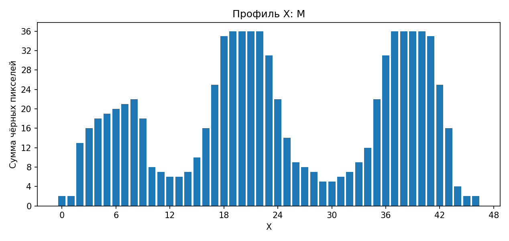

### Профиль Y

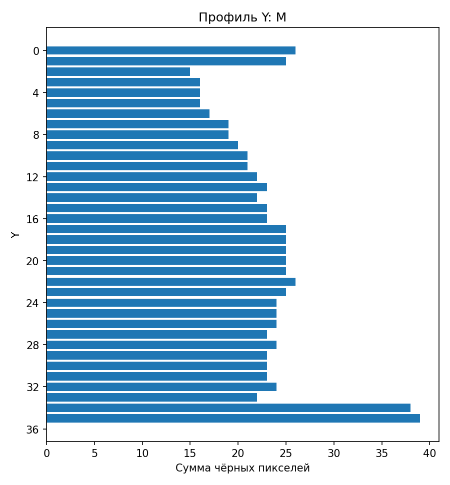

---
## Символ 15 — Н

### Изображение символа

### Скалярные характеристики

| Признак | Значение |
|---|---:|
| Ширина изображения | 32 |
| Высота изображения | 36 |
| Общий вес чёрного | 660 |
| Общий удельный вес | 0.572917 |
| Вес 1-й четверти | 174 |
| Вес 2-й четверти | 155 |
| Вес 3-й четверти | 155 |
| Вес 4-й четверти | 176 |
| Удельный вес 1-й четверти | 0.604167 |
| Удельный вес 2-й четверти | 0.538194 |
| Удельный вес 3-й четверти | 0.538194 |
| Удельный вес 4-й четверти | 0.611111 |
| Координата центра тяжести X | 15.910606 |
| Координата центра тяжести Y | 17.516667 |
| Нормированная координата X | 0.513245 |
| Нормированная координата Y | 0.500476 |
| Осевой момент инерции Ix | 74420.816667 |
| Осевой момент инерции Iy | 60193.725758 |
| Нормированный момент инерции Ix | 0.056078 |
| Нормированный момент инерции Iy | 0.045357 |

### Профиль X

### Профиль Y

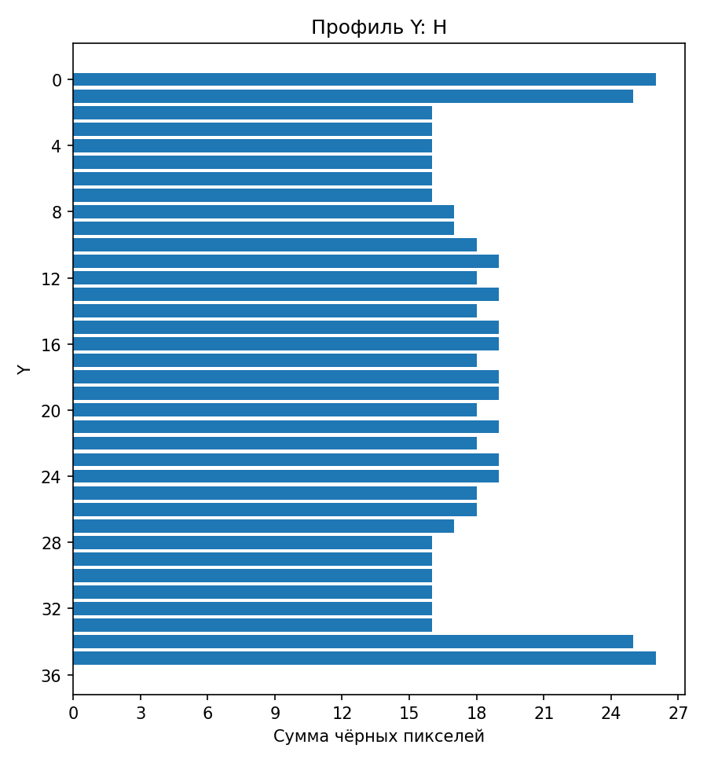

---
## Символ 16 — О

### Изображение символа

### Скалярные характеристики

| Признак | Значение |
|---|---:|
| Ширина изображения | 30 |
| Высота изображения | 38 |
| Общий вес чёрного | 517 |
| Общий удельный вес | 0.453509 |
| Вес 1-й четверти | 125 |
| Вес 2-й четверти | 133 |
| Вес 3-й четверти | 126 |
| Вес 4-й четверти | 133 |
| Удельный вес 1-й четверти | 0.438596 |
| Удельный вес 2-й четверти | 0.466667 |
| Удельный вес 3-й четверти | 0.442105 |
| Удельный вес 4-й четверти | 0.466667 |
| Координата центра тяжести X | 14.557060 |
| Координата центра тяжести Y | 18.535783 |
| Нормированная координата X | 0.501968 |
| Нормированная координата Y | 0.500967 |
| Осевой момент инерции Ix | 51354.588008 |
| Осевой момент инерции Iy | 49059.566731 |
| Нормированный момент инерции Ix | 0.039516 |
| Нормированный момент инерции Iy | 0.037750 |

### Профиль X

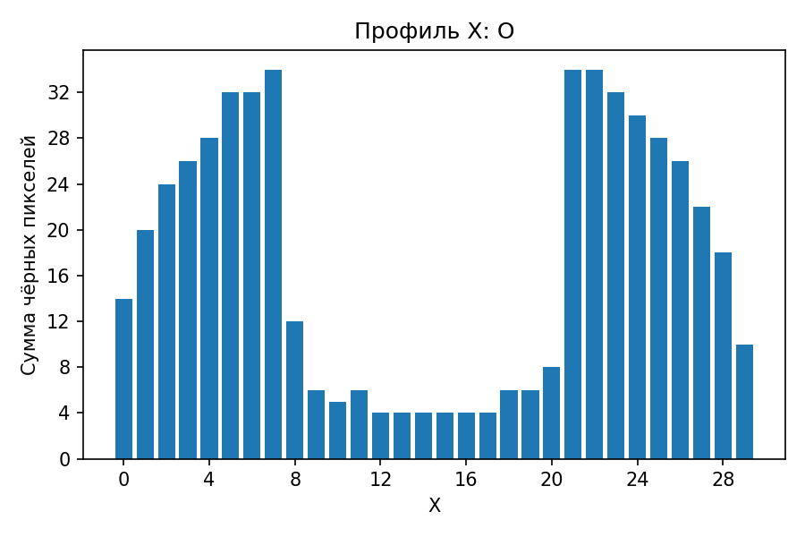

### Профиль Y

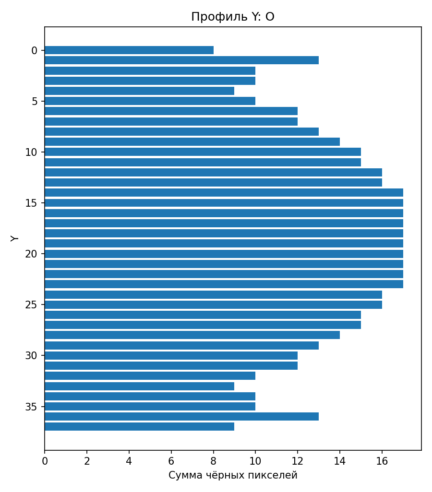

---
## Символ 17 — П

### Изображение символа

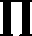

### Скалярные характеристики

| Признак | Значение |
|---|---:|
| Ширина изображения | 32 |
| Высота изображения | 36 |
| Общий вес чёрного | 627 |
| Общий удельный вес | 0.544271 |
| Вес 1-й четверти | 160 |
| Вес 2-й четверти | 160 |
| Вес 3-й четверти | 154 |
| Вес 4-й четверти | 153 |
| Удельный вес 1-й четверти | 0.555556 |
| Удельный вес 2-й четверти | 0.555556 |
| Удельный вес 3-й четверти | 0.534722 |
| Удельный вес 4-й четверти | 0.531250 |
| Координата центра тяжести X | 15.902711 |
| Координата центра тяжести Y | 17.148325 |
| Нормированная координата X | 0.512991 |
| Нормированная координата Y | 0.489952 |
| Осевой момент инерции Ix | 76851.205742 |
| Осевой момент инерции Iy | 59787.065391 |
| Нормированный момент инерции Ix | 0.057909 |
| Нормированный момент инерции Iy | 0.045051 |

### Профиль X

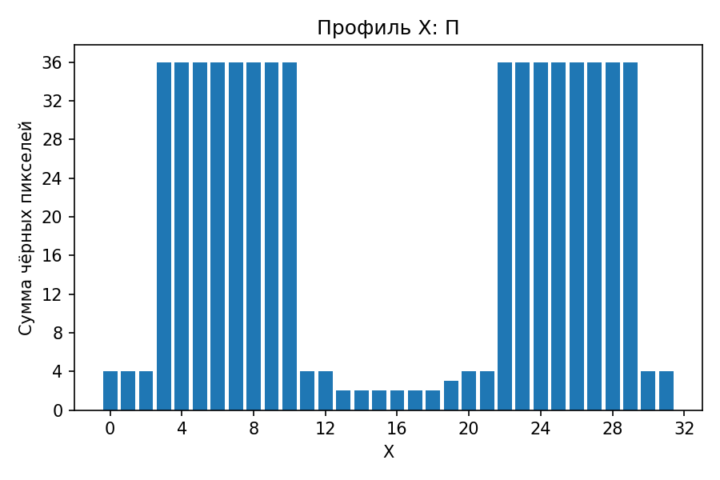

### Профиль Y

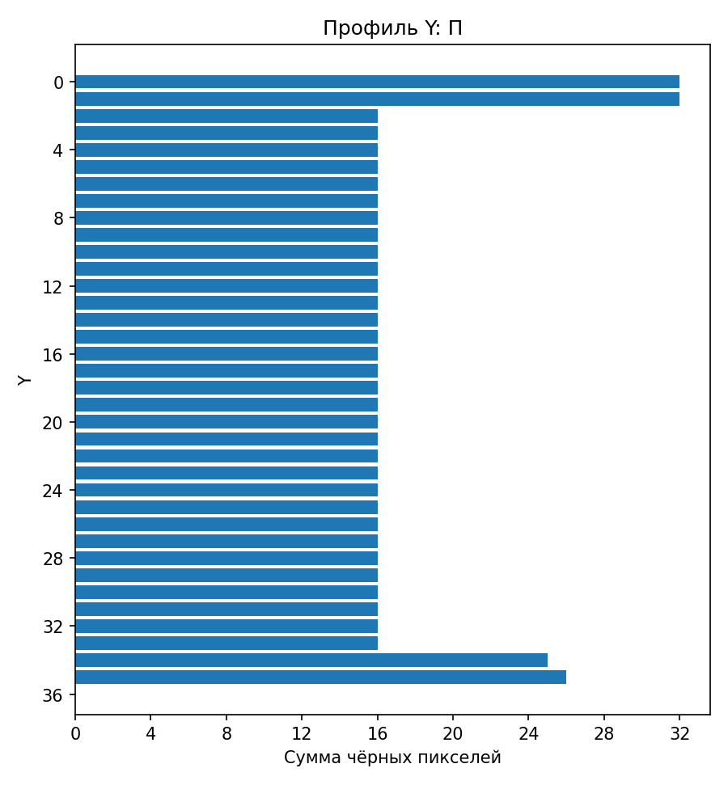

---
## Символ 18 — Р

### Изображение символа

### Скалярные характеристики

| Признак | Значение |
|---|---:|
| Ширина изображения | 27 |
| Высота изображения | 37 |
| Общий вес чёрного | 445 |
| Общий удельный вес | 0.445445 |
| Вес 1-й четверти | 127 |
| Вес 2-й четверти | 139 |
| Вес 3-й четверти | 162 |
| Вес 4-й четверти | 17 |
| Удельный вес 1-й четверти | 0.542735 |
| Удельный вес 2-й четверти | 0.551587 |
| Удельный вес 3-й четверти | 0.655870 |
| Удельный вес 4-й четверти | 0.063910 |
| Координата центра тяжести X | 11.193258 |
| Координата центра тяжести Y | 16.314607 |
| Нормированная координата X | 0.430510 |
| Нормированная координата Y | 0.453184 |
| Осевой момент инерции Ix | 45203.955056 |
| Осевой момент инерции Iy | 25803.379775 |
| Нормированный момент инерции Ix | 0.045294 |
| Нормированный момент инерции Iy | 0.025855 |

### Профиль X

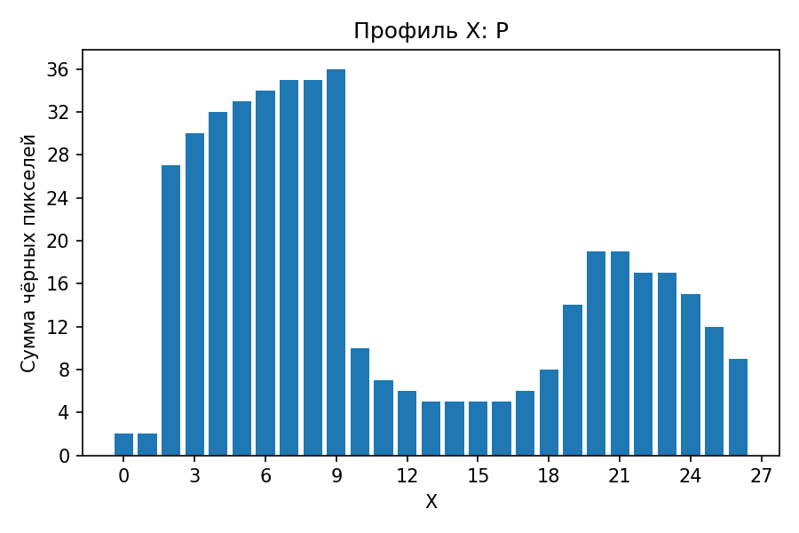

### Профиль Y

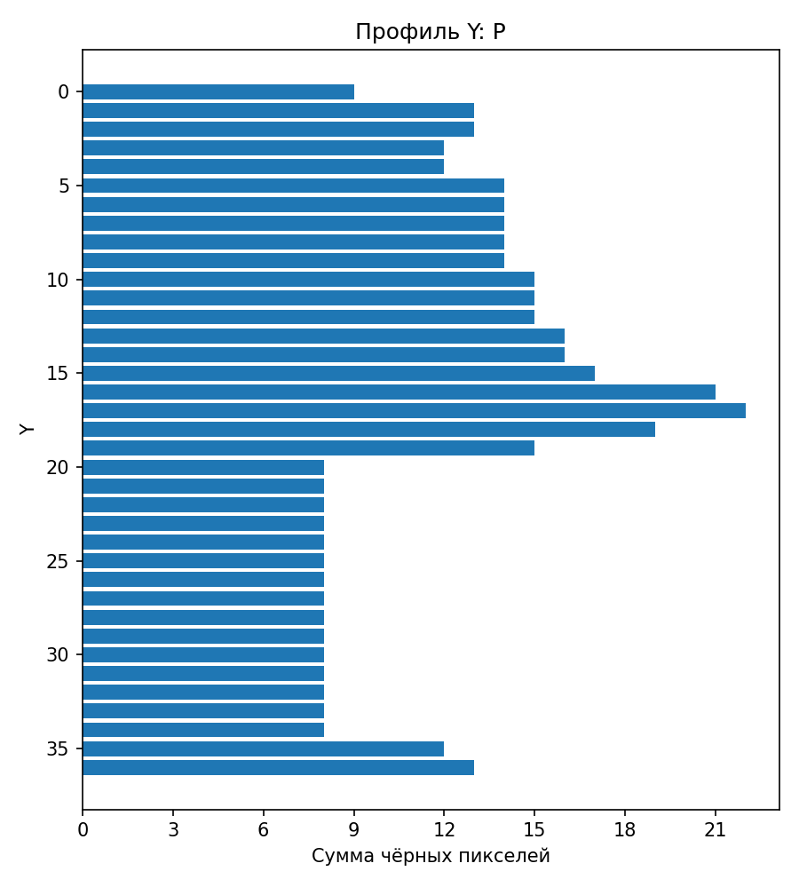

---
## Символ 19 — С

### Изображение символа

### Скалярные характеристики

| Признак | Значение |
|---|---:|
| Ширина изображения | 31 |
| Высота изображения | 38 |
| Общий вес чёрного | 470 |
| Общий удельный вес | 0.398981 |
| Вес 1-й четверти | 124 |
| Вес 2-й четверти | 110 |
| Вес 3-й четверти | 126 |
| Вес 4-й четверти | 110 |
| Удельный вес 1-й четверти | 0.435088 |
| Удельный вес 2-й четверти | 0.361842 |
| Удельный вес 3-й четверти | 0.442105 |
| Удельный вес 4-й четверти | 0.361842 |
| Координата центра тяжести X | 13.487234 |
| Координата центра тяжести Y | 18.572340 |
| Нормированная координата X | 0.449574 |
| Нормированная координата Y | 0.501955 |
| Осевой момент инерции Ix | 50693.040426 |
| Осевой момент инерции Iy | 42709.423404 |
| Нормированный момент инерции Ix | 0.036531 |
| Нормированный момент инерции Iy | 0.030777 |

### Профиль X

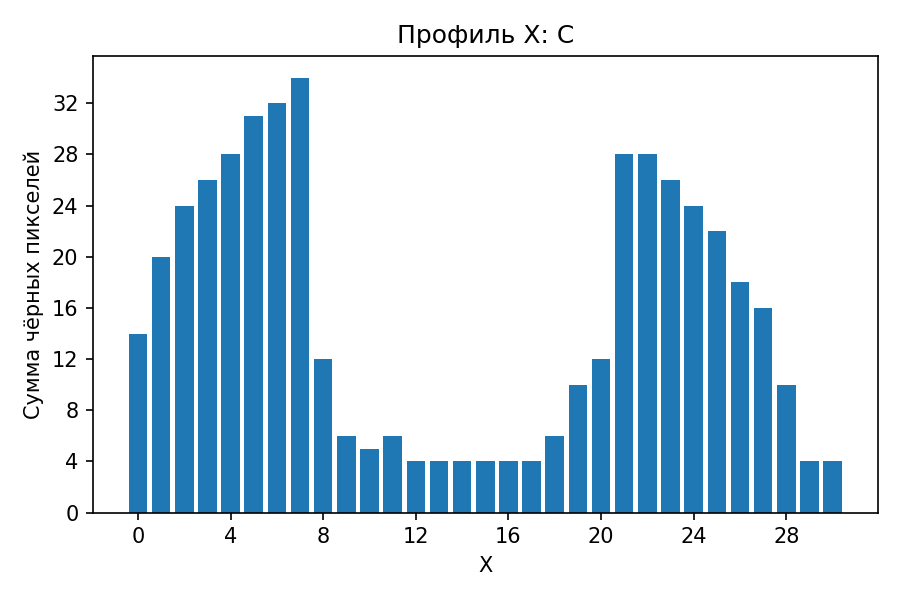

### Профиль Y

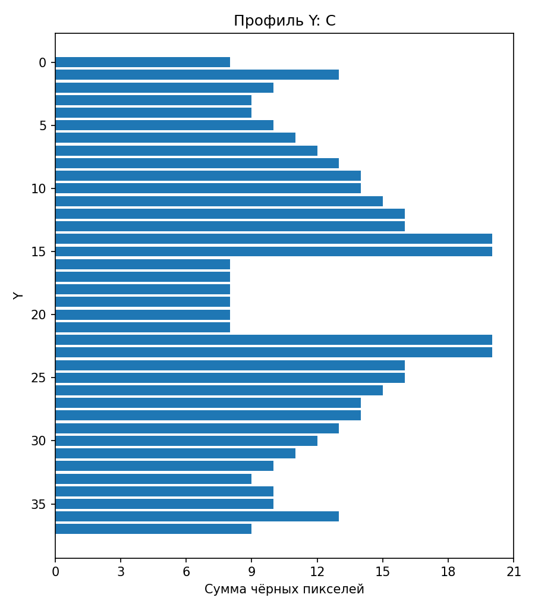

---
## Символ 20 — Т

### Изображение символа

### Скалярные характеристики

| Признак | Значение |
|---|---:|
| Ширина изображения | 35 |
| Высота изображения | 36 |
| Общий вес чёрного | 415 |
| Общий удельный вес | 0.329365 |
| Вес 1-й четверти | 131 |
| Вес 2-й четверти | 146 |
| Вес 3-й четверти | 60 |
| Вес 4-й четверти | 78 |
| Удельный вес 1-й четверти | 0.428105 |
| Удельный вес 2-й четверти | 0.450617 |
| Удельный вес 3-й четверти | 0.196078 |
| Удельный вес 4-й четверти | 0.240741 |
| Координата центра тяжести X | 16.872289 |
| Координата центра тяжести Y | 12.881928 |
| Нормированная координата X | 0.496244 |
| Нормированная координата Y | 0.368055 |
| Осевой момент инерции Ix | 53083.214458 |
| Осевой момент инерции Iy | 25148.231325 |
| Нормированный момент инерции Ix | 0.033436 |
| Нормированный момент инерции Iy | 0.015840 |

### Профиль X

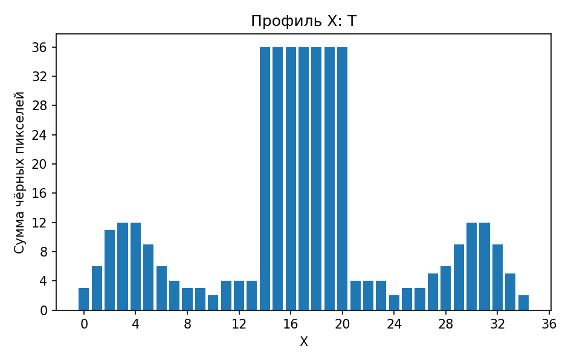

### Профиль Y

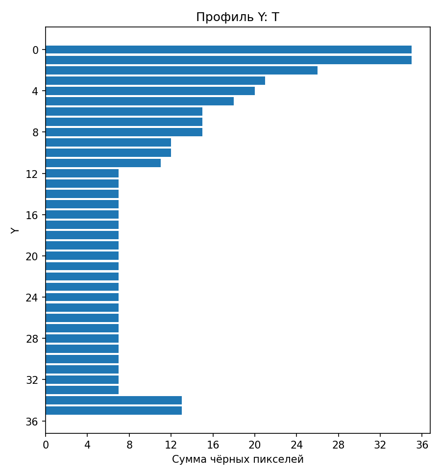

---
## Символ 21 — Ѹ

### Изображение символа

### Скалярные характеристики

| Признак | Значение |
|---|---:|
| Ширина изображения | 59 |
| Высота изображения | 52 |
| Общий вес чёрного | 837 |
| Общий удельный вес | 0.272816 |
| Вес 1-й четверти | 365 |
| Вес 2-й четверти | 167 |
| Вес 3-й четверти | 142 |
| Вес 4-й четверти | 163 |
| Удельный вес 1-й четверти | 0.484085 |
| Удельный вес 2-й четверти | 0.214103 |
| Удельный вес 3-й четверти | 0.188329 |
| Удельный вес 4-й четверти | 0.208974 |
| Координата центра тяжести X | 25.752688 |
| Координата центра тяжести Y | 21.946237 |
| Нормированная координата X | 0.444012 |
| Нормированная координата Y | 0.430318 |
| Осевой момент инерции Ix | 106368.580645 |
| Осевой момент инерции Iy | 230497.806452 |
| Нормированный момент инерции Ix | 0.011301 |
| Нормированный момент инерции Iy | 0.024488 |

### Профиль X

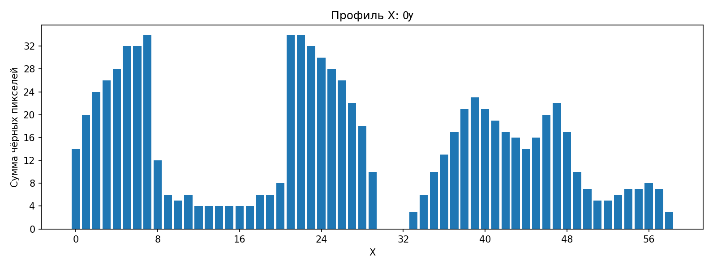

### Профиль Y

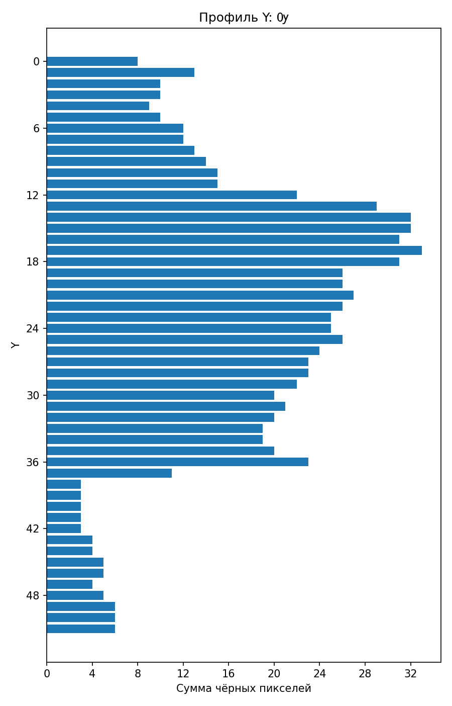

---
## Символ 22 — Ф

### Изображение символа

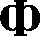

### Скалярные характеристики

| Признак | Значение |
|---|---:|
| Ширина изображения | 40 |
| Высота изображения | 36 |
| Общий вес чёрного | 714 |
| Общий удельный вес | 0.495833 |
| Вес 1-й четверти | 179 |
| Вес 2-й четверти | 179 |
| Вес 3-й четверти | 179 |
| Вес 4-й четверти | 177 |
| Удельный вес 1-й четверти | 0.497222 |
| Удельный вес 2-й четверти | 0.497222 |
| Удельный вес 3-й четверти | 0.497222 |
| Удельный вес 4-й четверти | 0.491667 |
| Координата центра тяжести X | 19.535014 |
| Координата центра тяжести Y | 17.462185 |
| Нормированная координата X | 0.500898 |
| Нормированная координата Y | 0.498920 |
| Осевой момент инерции Ix | 59547.478992 |
| Осевой момент инерции Iy | 83583.624650 |
| Нормированный момент инерции Ix | 0.028717 |
| Нормированный момент инерции Iy | 0.040308 |

### Профиль X

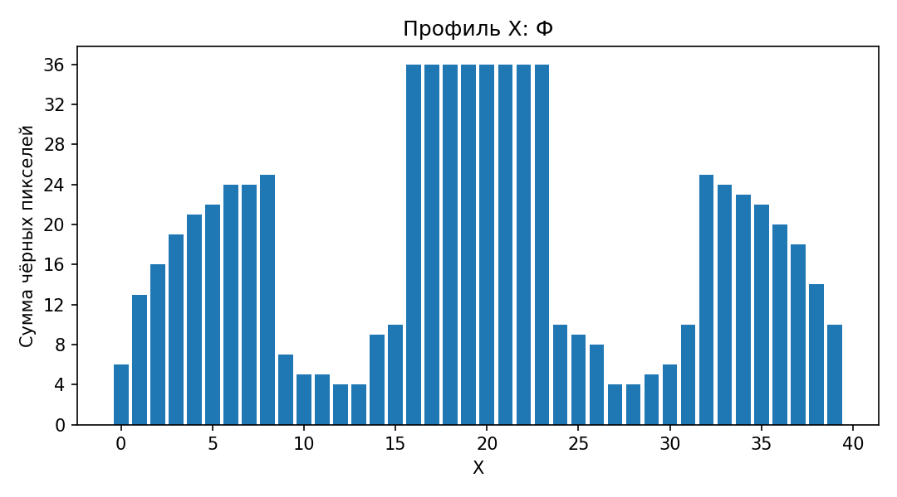

### Профиль Y

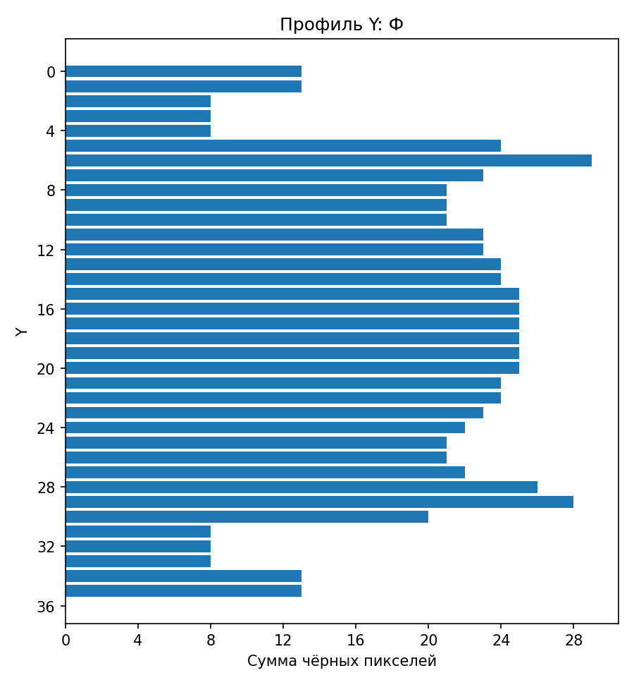

---
## Символ 23 — Х

### Изображение символа

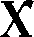

### Скалярные характеристики

| Признак | Значение |
|---|---:|
| Ширина изображения | 34 |
| Высота изображения | 37 |
| Общий вес чёрного | 458 |
| Общий удельный вес | 0.364070 |
| Вес 1-й четверти | 141 |
| Вес 2-й четверти | 95 |
| Вес 3-й четверти | 81 |
| Вес 4-й четверти | 141 |
| Удельный вес 1-й четверти | 0.460784 |
| Удельный вес 2-й четверти | 0.310458 |
| Удельный вес 3-й четверти | 0.250774 |
| Удельный вес 4-й четверти | 0.436533 |
| Координата центра тяжести X | 16.674672 |
| Координата центра тяжести Y | 17.362445 |
| Нормированная координата X | 0.505293 |
| Нормированная координата Y | 0.482290 |
| Осевой момент инерции Ix | 63419.834061 |
| Осевой момент инерции Iy | 27698.526201 |
| Нормированный момент инерции Ix | 0.040074 |
| Нормированный момент инерции Iy | 0.017502 |

### Профиль X

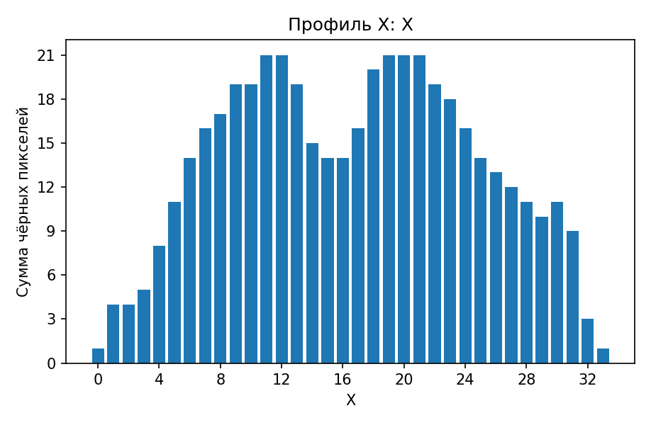

### Профиль Y

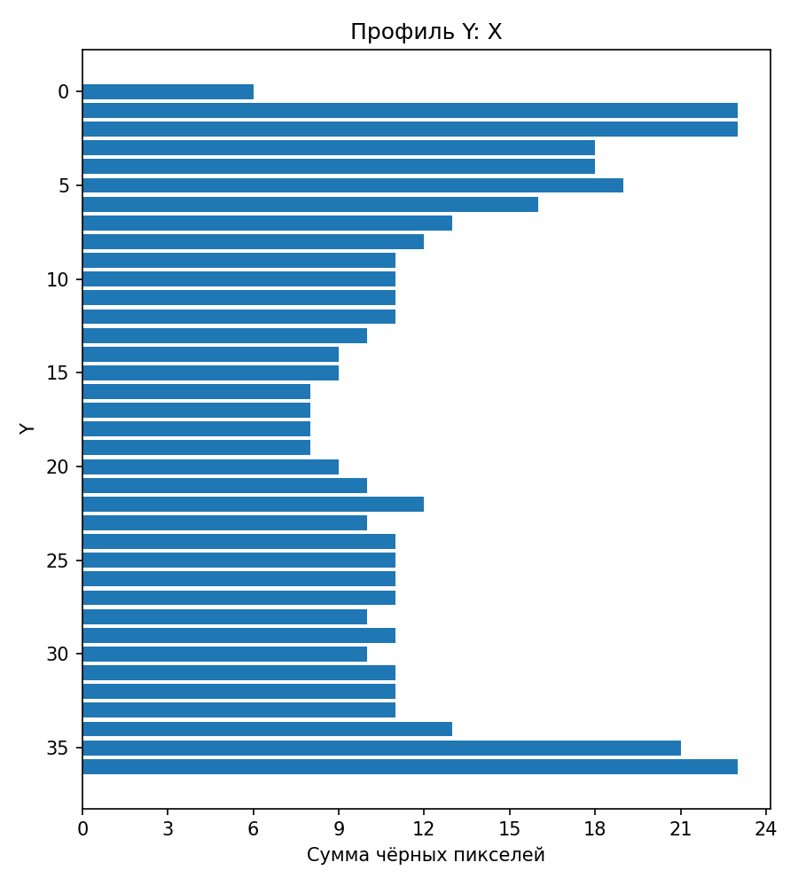

---
## Символ 24 — Ц

### Изображение символа

### Скалярные характеристики

| Признак | Значение |
|---|---:|
| Ширина изображения | 35 |
| Высота изображения | 47 |
| Общий вес чёрного | 650 |
| Общий удельный вес | 0.395137 |
| Вес 1-й четверти | 194 |
| Вес 2-й четверти | 173 |
| Вес 3-й четверти | 122 |
| Вес 4-й четверти | 161 |
| Удельный вес 1-й четверти | 0.496164 |
| Удельный вес 2-й четверти | 0.417874 |
| Удельный вес 3-й четверти | 0.299020 |
| Удельный вес 4-й четверти | 0.372685 |
| Координата центра тяжести X | 16.486154 |
| Координата центра тяжести Y | 19.587692 |
| Нормированная координата X | 0.484887 |
| Нормированная координата Y | 0.425819 |
| Осевой момент инерции Ix | 96819.501538 |
| Осевой момент инерции Iy | 66006.375385 |
| Нормированный момент инерции Ix | 0.035779 |
| Нормированный момент инерции Iy | 0.024392 |

### Профиль X

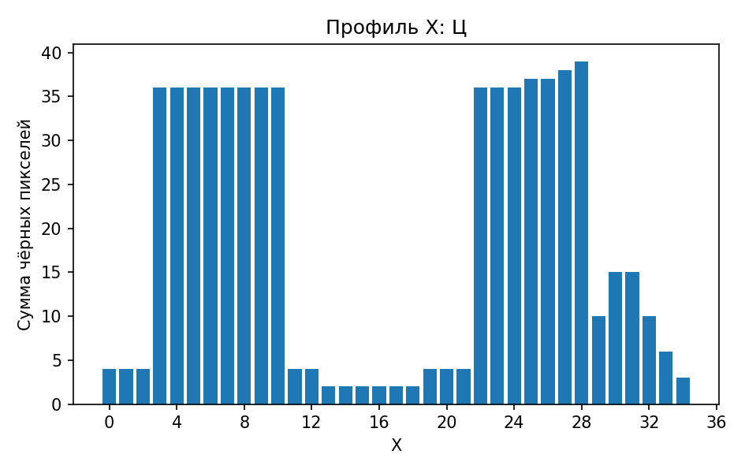

### Профиль Y

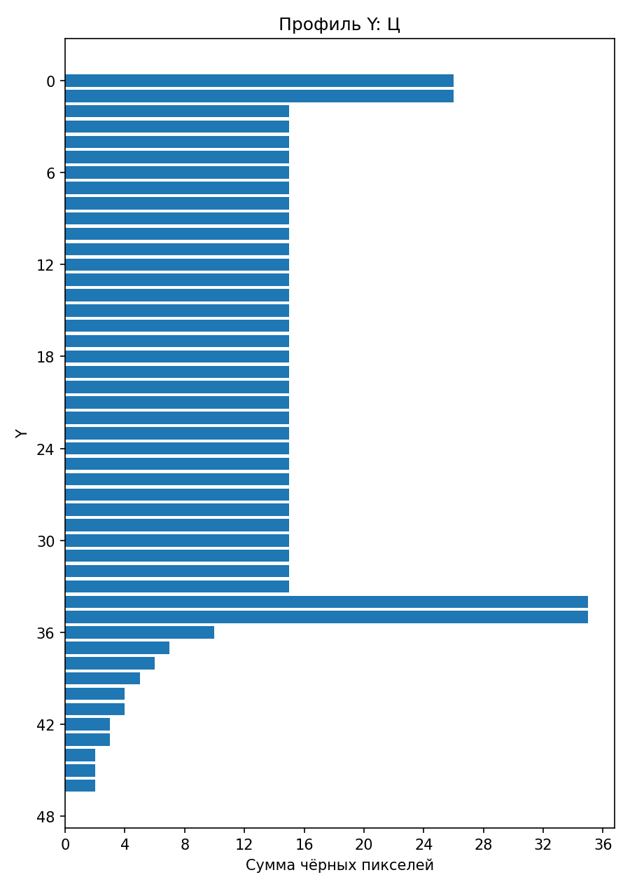

---
## Символ 25 — Ч

### Изображение символа

### Скалярные характеристики

| Признак | Значение |
|---|---:|
| Ширина изображения | 30 |
| Высота изображения | 36 |
| Общий вес чёрного | 482 |
| Общий удельный вес | 0.446296 |
| Вес 1-й четверти | 142 |
| Вес 2-й четверти | 153 |
| Вес 3-й четверти | 25 |
| Вес 4-й четверти | 162 |
| Удельный вес 1-й четверти | 0.525926 |
| Удельный вес 2-й четверти | 0.566667 |
| Удельный вес 3-й четверти | 0.092593 |
| Удельный вес 4-й четверти | 0.600000 |
| Координата центра тяжести X | 16.952282 |
| Координата центра тяжести Y | 14.811203 |
| Нормированная координата X | 0.584561 |
| Нормированная координата Y | 0.423177 |
| Осевой момент инерции Ix | 50019.819502 |
| Осевой момент инерции Iy | 30373.902490 |
| Нормированный момент инерции Ix | 0.042884 |
| Нормированный момент инерции Iy | 0.026041 |

### Профиль X

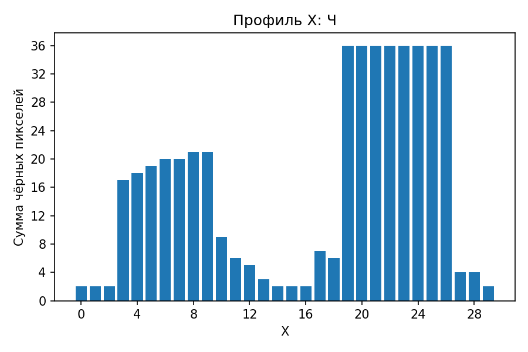

### Профиль Y

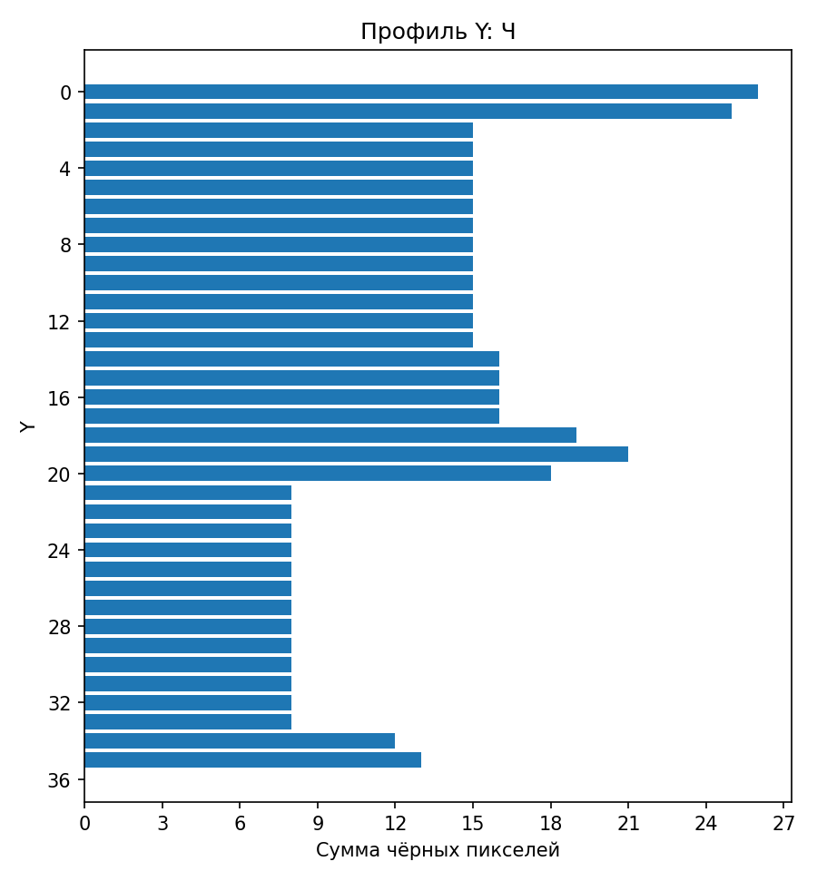

---
## Символ 26 — Ш

### Изображение символа

### Скалярные характеристики

| Признак | Значение |
|---|---:|
| Ширина изображения | 46 |
| Высота изображения | 36 |
| Общий вес чёрного | 937 |
| Общий удельный вес | 0.565821 |
| Вес 1-й четверти | 230 |
| Вес 2-й четверти | 231 |
| Вес 3-й четверти | 238 |
| Вес 4-й четверти | 238 |
| Удельный вес 1-й четверти | 0.555556 |
| Удельный вес 2-й четверти | 0.557971 |
| Удельный вес 3-й четверти | 0.574879 |
| Удельный вес 4-й четверти | 0.574879 |
| Координата центра тяжести X | 22.775880 |
| Координата центра тяжести Y | 17.771612 |
| Нормированная координата X | 0.506131 |
| Нормированная координата Y | 0.507760 |
| Осевой момент инерции Ix | 114303.124867 |
| Осевой момент инерции Iy | 174840.934899 |
| Нормированный момент инерции Ix | 0.041681 |
| Нормированный момент инерции Iy | 0.063756 |

### Профиль X

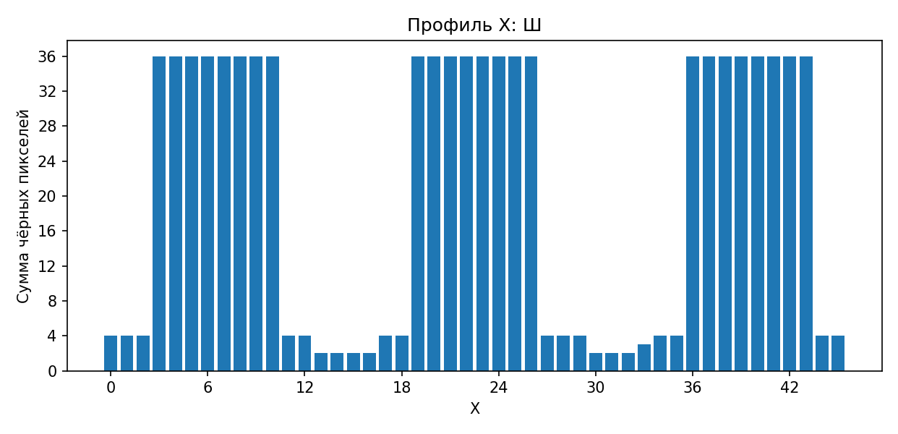

### Профиль Y

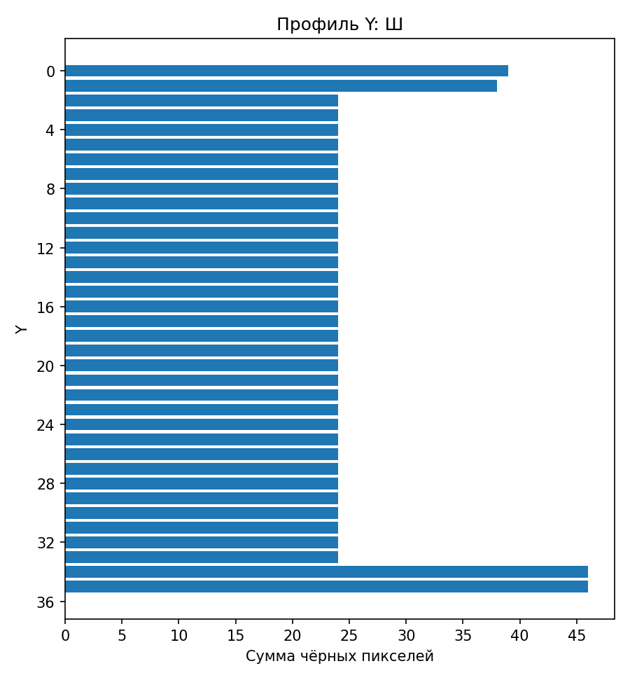

---
## Символ 27 — Щ

### Изображение символа

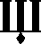

### Скалярные характеристики

| Признак | Значение |
|---|---:|
| Ширина изображения | 46 |
| Высота изображения | 49 |
| Общий вес чёрного | 1012 |
| Общий удельный вес | 0.448980 |
| Вес 1-й четверти | 302 |
| Вес 2-й четверти | 303 |
| Вес 3-й четверти | 200 |
| Вес 4-й четверти | 207 |
| Удельный вес 1-й четверти | 0.547101 |
| Удельный вес 2-й четверти | 0.548913 |
| Удельный вес 3-й четверти | 0.347826 |
| Удельный вес 4-й четверти | 0.360000 |
| Координата центра тяжести X | 22.777668 |
| Координата центра тяжести Y | 19.583992 |
| Нормированная координата X | 0.506170 |
| Нормированная координата Y | 0.408000 |
| Осевой момент инерции Ix | 156477.860672 |
| Осевой момент инерции Iy | 175178.975296 |
| Нормированный момент инерции Ix | 0.030800 |
| Нормированный момент инерции Iy | 0.034481 |

### Профиль X

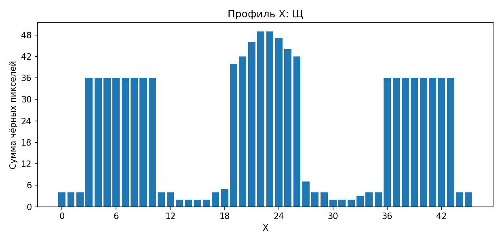

### Профиль Y

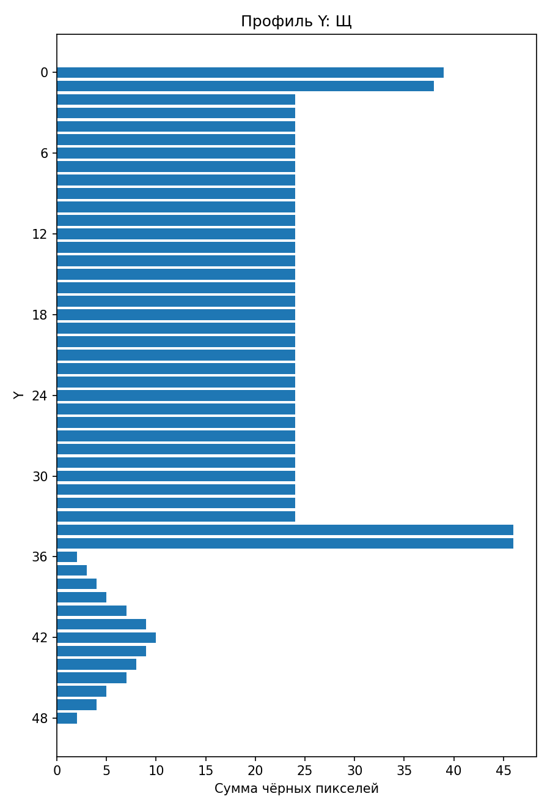

---
## Символ 28 — Ъ

### Изображение символа

### Скалярные характеристики

| Признак | Значение |
|---|---:|
| Ширина изображения | 39 |
| Высота изображения | 36 |
| Общий вес чёрного | 542 |
| Общий удельный вес | 0.386040 |
| Вес 1-й четверти | 151 |
| Вес 2-й четверти | 83 |
| Вес 3-й четверти | 78 |
| Вес 4-й четверти | 230 |
| Удельный вес 1-й четверти | 0.441520 |
| Удельный вес 2-й четверти | 0.230556 |
| Удельный вес 3-й четверти | 0.228070 |
| Удельный вес 4-й четверти | 0.638889 |
| Координата центра тяжести X | 20.909594 |
| Координата центра тяжести Y | 18.201107 |
| Нормированная координата X | 0.550252 |
| Нормированная координата Y | 0.520032 |
| Осевой момент инерции Ix | 68775.079336 |
| Осевой момент инерции Iy | 51980.570111 |
| Нормированный момент инерции Ix | 0.034890 |
| Нормированный момент инерции Iy | 0.026370 |

### Профиль X

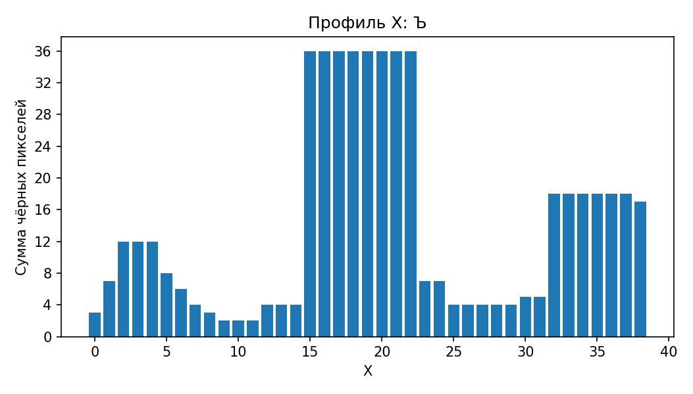

### Профиль Y

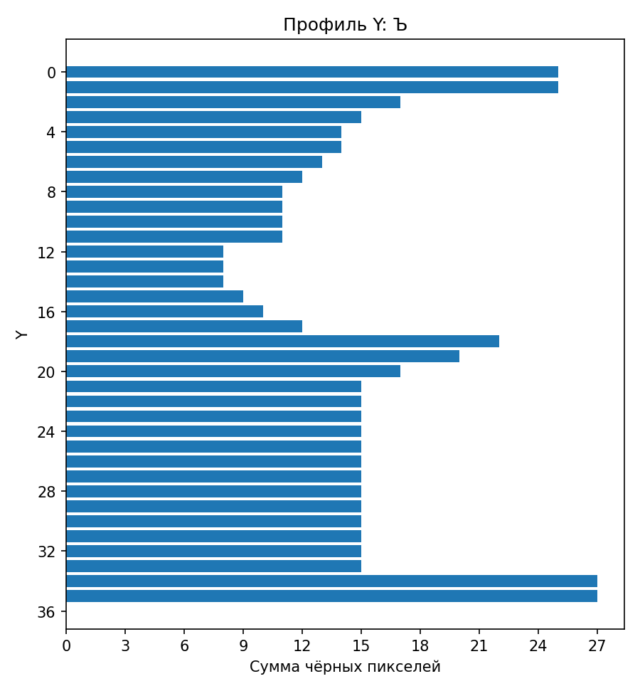

---
## Символ 29 — Ы

### Изображение символа

### Скалярные характеристики

| Признак | Значение |
|---|---:|
| Ширина изображения | 43 |
| Высота изображения | 36 |
| Общий вес чёрного | 760 |
| Общий удельный вес | 0.490956 |
| Вес 1-й четверти | 162 |
| Вес 2-й четверти | 138 |
| Вес 3-й четверти | 200 |
| Вес 4-й четверти | 260 |
| Удельный вес 1-й четверти | 0.428571 |
| Удельный вес 2-й четверти | 0.348485 |
| Удельный вес 3-й четверти | 0.529101 |
| Удельный вес 4-й четверти | 0.656566 |
| Координата центра тяжести X | 20.717105 |
| Координата центра тяжести Y | 19.481579 |
| Нормированная координата X | 0.493264 |
| Нормированная координата Y | 0.556617 |
| Осевой момент инерции Ix | 87063.742105 |
| Осевой момент инерции Iy | 134094.177632 |
| Нормированный момент инерции Ix | 0.036333 |
| Нормированный момент инерции Iy | 0.055959 |

### Профиль X

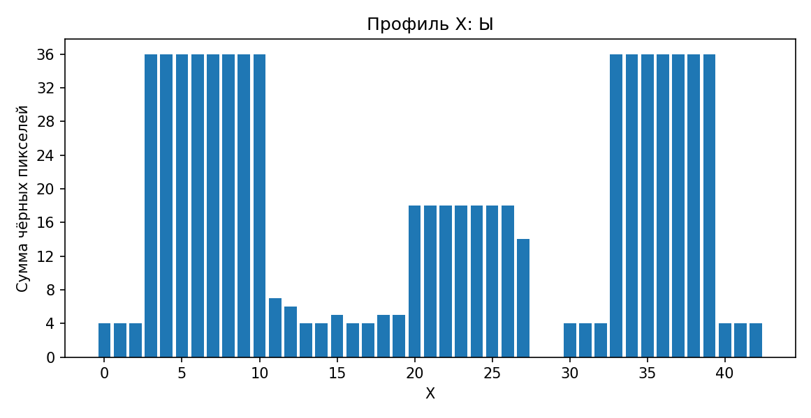

### Профиль Y

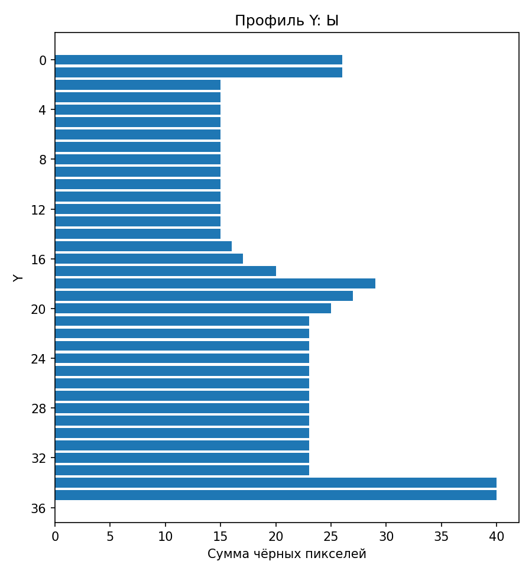

---
## Символ 30 — Ь

### Изображение символа

### Скалярные характеристики

| Признак | Значение |
|---|---:|
| Ширина изображения | 28 |
| Высота изображения | 36 |
| Общий вес чёрного | 484 |
| Общий удельный вес | 0.480159 |
| Вес 1-й четверти | 160 |
| Вес 2-й четверти | 2 |
| Вес 3-й четверти | 157 |
| Вес 4-й четверти | 165 |
| Удельный вес 1-й четверти | 0.634921 |
| Удельный вес 2-й четверти | 0.007937 |
| Удельный вес 3-й четверти | 0.623016 |
| Удельный вес 4-й четверти | 0.654762 |
| Координата центра тяжести X | 12.002066 |
| Координата центра тяжести Y | 20.611570 |
| Нормированная координата X | 0.444521 |
| Нормированная координата Y | 0.588902 |
| Осевой момент инерции Ix | 51224.975207 |
| Осевой момент инерции Iy | 31244.997934 |
| Нормированный момент инерции Ix | 0.050415 |
| Нормированный момент инерции Iy | 0.030751 |

### Профиль X

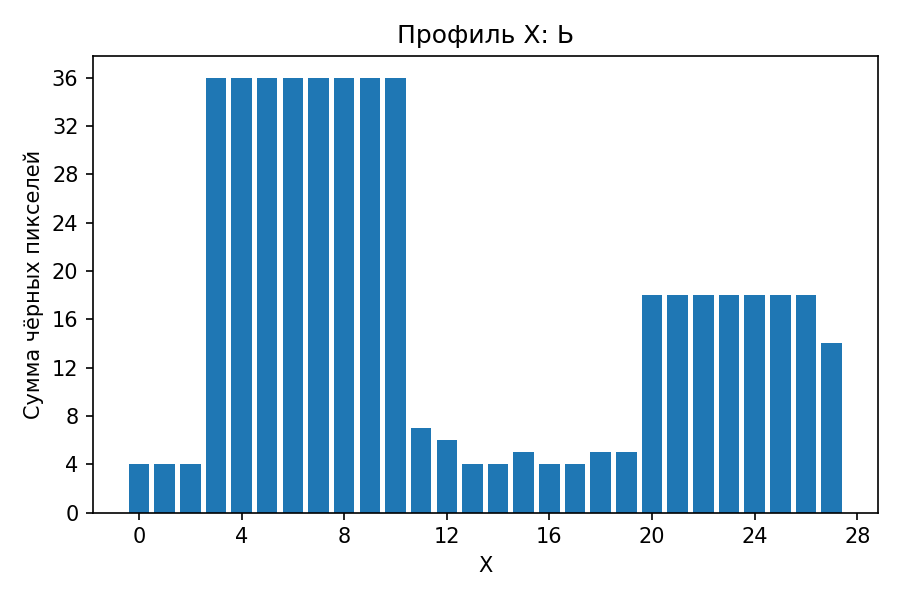

### Профиль Y

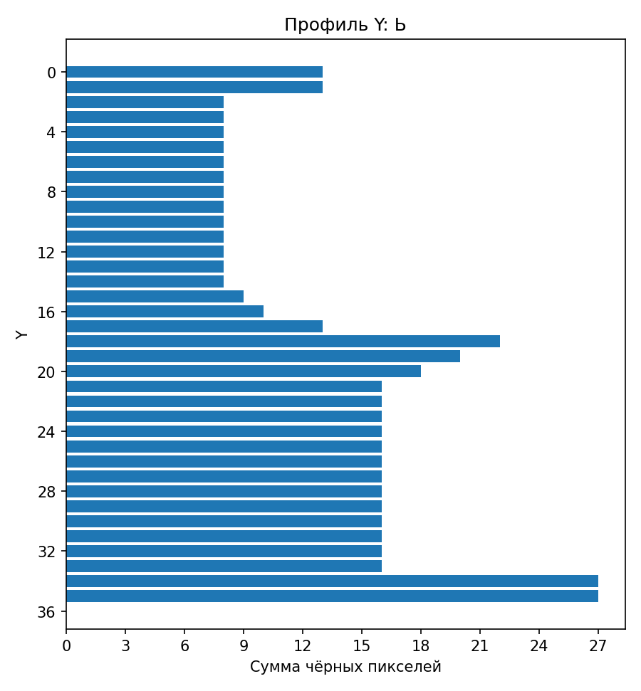

---
## Символ 31 — Ѣ

### Изображение символа

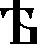

### Скалярные характеристики

| Признак | Значение |
|---|---:|
| Ширина изображения | 37 |
| Высота изображения | 44 |
| Общий вес чёрного | 608 |
| Общий удельный вес | 0.373464 |
| Вес 1-й четверти | 172 |
| Вес 2-й четверти | 111 |
| Вес 3-й четверти | 116 |
| Вес 4-й четверти | 209 |
| Удельный вес 1-й четверти | 0.434343 |
| Удельный вес 2-й четверти | 0.265550 |
| Удельный вес 3-й четверти | 0.292929 |
| Удельный вес 4-й четверти | 0.500000 |
| Координата центра тяжести X | 20.064145 |
| Координата центра тяжести Y | 22.985197 |
| Нормированная координата X | 0.557337 |
| Нормированная координата Y | 0.534539 |
| Осевой момент инерции Ix | 100380.866776 |
| Осевой момент инерции Iy | 49364.498355 |
| Нормированный момент инерции Ix | 0.037874 |
| Нормированный момент инерции Iy | 0.018625 |

### Профиль X

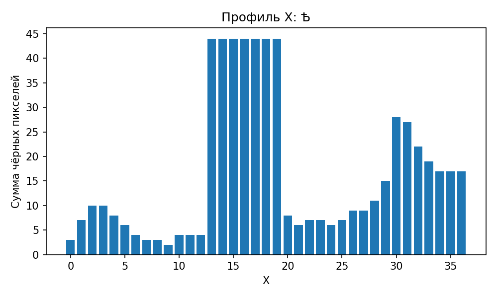

### Профиль Y

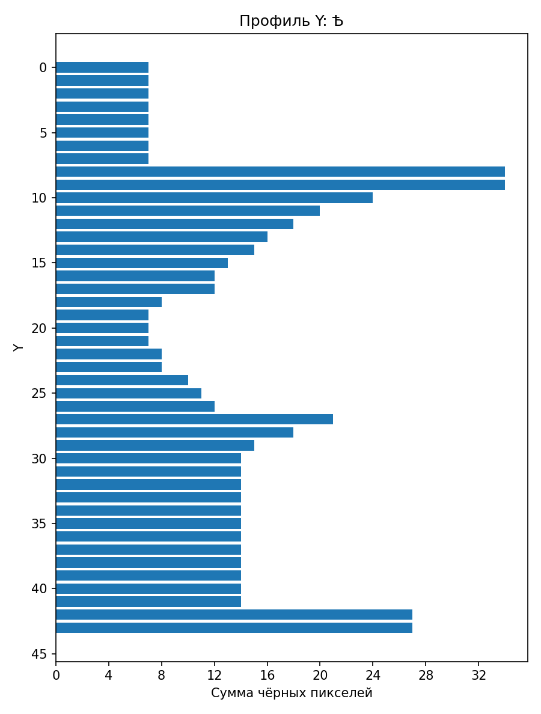

---
## Символ 32 — Ю

### Изображение символа

### Скалярные характеристики

| Признак | Значение |
|---|---:|
| Ширина изображения | 46 |
| Высота изображения | 38 |
| Общий вес чёрного | 835 |
| Общий удельный вес | 0.477689 |
| Вес 1-й четверти | 252 |
| Вес 2-й четверти | 170 |
| Вес 3-й четверти | 243 |
| Вес 4-й четверти | 170 |
| Удельный вес 1-й четверти | 0.576659 |
| Удельный вес 2-й четверти | 0.389016 |
| Удельный вес 3-й четверти | 0.556064 |
| Удельный вес 4-й четверти | 0.389016 |
| Координата центра тяжести X | 21.439521 |
| Координата центра тяжести Y | 18.505389 |
| Нормированная координата X | 0.476434 |
| Нормированная координата Y | 0.500146 |
| Осевой момент инерции Ix | 88472.725749 |
| Осевой момент инерции Iy | 164383.695808 |
| Нормированный момент инерции Ix | 0.028955 |
| Нормированный момент инерции Iy | 0.053799 |

### Профиль X

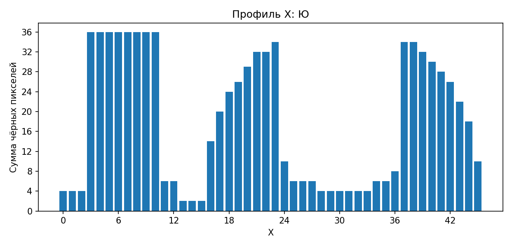

### Профиль Y

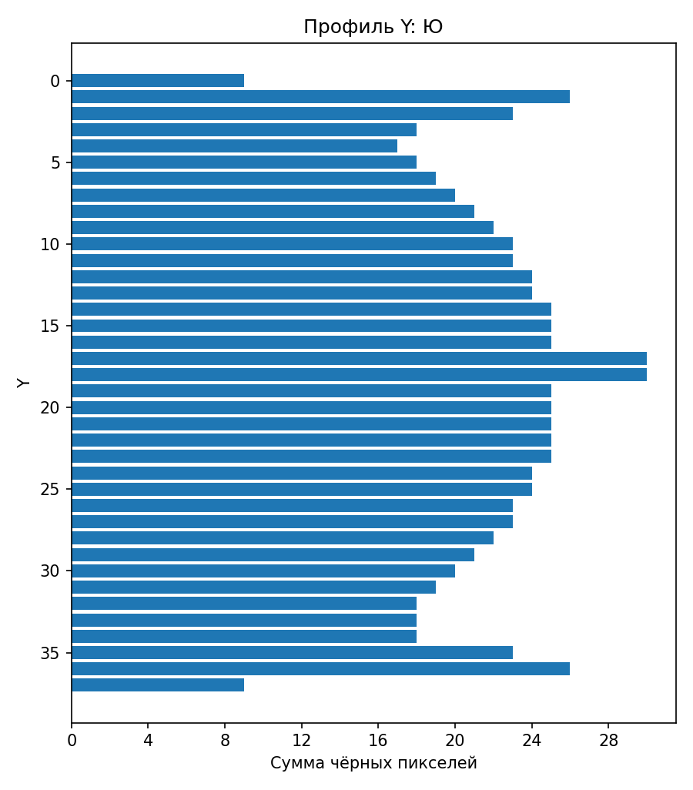

---
## Символ 33 — Ѵ

### Изображение символа

### Скалярные характеристики

| Признак | Значение |
|---|---:|
| Ширина изображения | 37 |
| Высота изображения | 37 |
| Общий вес чёрного | 439 |
| Общий удельный вес | 0.320672 |
| Вес 1-й четверти | 144 |
| Вес 2-й четверти | 99 |
| Вес 3-й четверти | 149 |
| Вес 4-й четверти | 47 |
| Удельный вес 1-й четверти | 0.444444 |
| Удельный вес 2-й четверти | 0.289474 |
| Удельный вес 3-й четверти | 0.435673 |
| Удельный вес 4-й четверти | 0.130194 |
| Координата центра тяжести X | 15.334852 |
| Координата центра тяжести Y | 16.145786 |
| Нормированная координата X | 0.425968 |
| Нормированная координата Y | 0.448494 |
| Осевой момент инерции Ix | 54164.669704 |
| Осевой момент инерции Iy | 33835.776765 |
| Нормированный момент инерции Ix | 0.028901 |
| Нормированный момент инерции Iy | 0.018054 |

### Профиль X

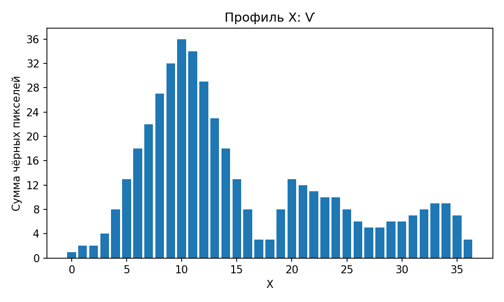

### Профиль Y

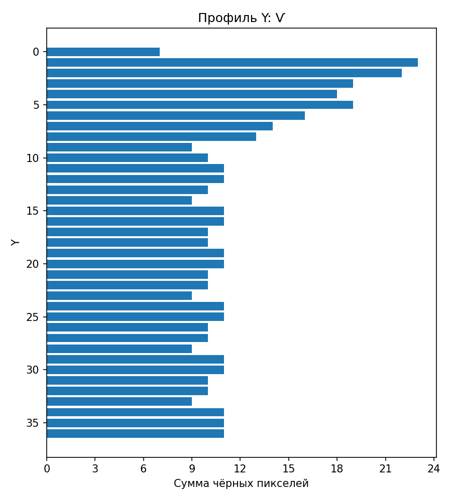

---
## Символ 34 — Ѯ

### Изображение символа

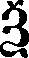

### Скалярные характеристики

| Признак | Значение |
|---|---:|
| Ширина изображения | 29 |
| Высота изображения | 58 |
| Общий вес чёрного | 726 |
| Общий удельный вес | 0.431629 |
| Вес 1-й четверти | 140 |
| Вес 2-й четверти | 198 |
| Вес 3-й четверти | 152 |
| Вес 4-й четверти | 236 |
| Удельный вес 1-й четверти | 0.344828 |
| Удельный вес 2-й четверти | 0.455172 |
| Удельный вес 3-й четверти | 0.374384 |
| Удельный вес 4-й четверти | 0.542529 |
| Координата центра тяжести X | 15.626722 |
| Координата центра тяжести Y | 30.112948 |
| Нормированная координата X | 0.558097 |
| Нормированная координата Y | 0.528297 |
| Осевой момент инерции Ix | 206530.738292 |
| Осевой момент инерции Iy | 45815.841598 |
| Нормированный момент инерции Ix | 0.073002 |
| Нормированный момент инерции Iy | 0.016194 |

### Профиль X

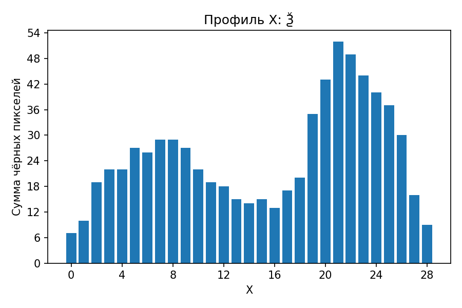

### Профиль Y

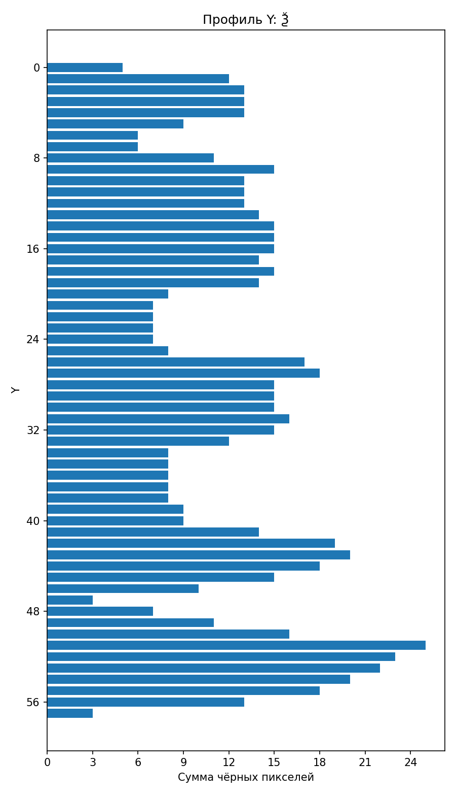

---
## Символ 35 — Ѱ

### Изображение символа

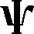

### Скалярные характеристики

| Признак | Значение |
|---|---:|
| Ширина изображения | 44 |
| Высота изображения | 44 |
| Общий вес чёрного | 690 |
| Общий удельный вес | 0.356405 |
| Вес 1-й четверти | 206 |
| Вес 2-й четверти | 182 |
| Вес 3-й четверти | 180 |
| Вес 4-й четверти | 122 |
| Удельный вес 1-й четверти | 0.425620 |
| Удельный вес 2-й четверти | 0.376033 |
| Удельный вес 3-й четверти | 0.371901 |
| Удельный вес 4-й четверти | 0.252066 |
| Координата центра тяжести X | 20.266667 |
| Координата центра тяжести Y | 20.034783 |
| Нормированная координата X | 0.471318 |
| Нормированная координата Y | 0.465925 |
| Осевой момент инерции Ix | 86173.165217 |
| Осевой момент инерции Iy | 55846.933333 |
| Нормированный момент инерции Ix | 0.022991 |
| Нормированный момент инерции Iy | 0.014900 |

### Профиль X

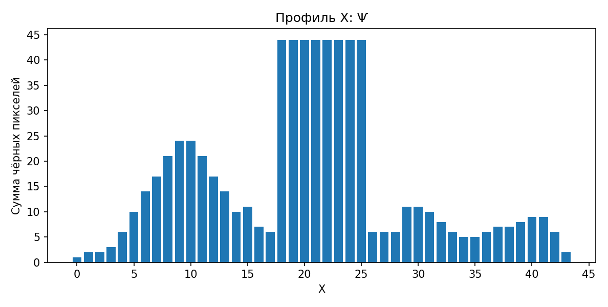

### Профиль Y

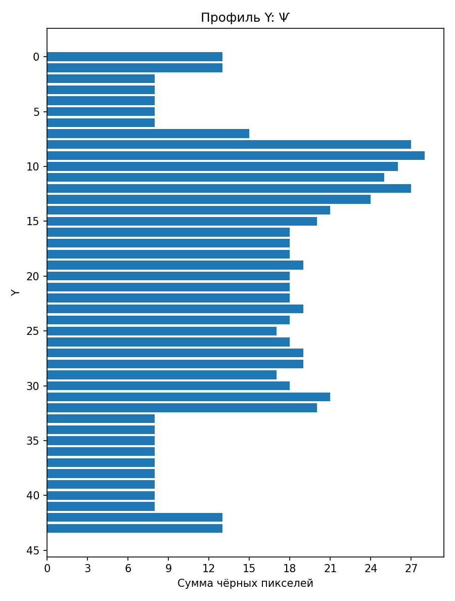

---
## Символ 36 — Ѡ

### Изображение символа

### Скалярные характеристики

| Признак | Значение |
|---|---:|
| Ширина изображения | 47 |
| Высота изображения | 37 |
| Общий вес чёрного | 861 |
| Общий удельный вес | 0.495112 |
| Вес 1-й четверти | 237 |
| Вес 2-й четверти | 214 |
| Вес 3-й четверти | 221 |
| Вес 4-й четверти | 189 |
| Удельный вес 1-й четверти | 0.572464 |
| Удельный вес 2-й четверти | 0.495370 |
| Удельный вес 3-й четверти | 0.505721 |
| Удельный вес 4-й четверти | 0.414474 |
| Координата центра тяжести X | 21.368177 |
| Координата центра тяжести Y | 16.857143 |
| Нормированная координата X | 0.464526 |
| Нормированная координата Y | 0.468254 |
| Осевой момент инерции Ix | 104877.428571 |
| Осевой момент инерции Iy | 170352.288037 |
| Нормированный момент инерции Ix | 0.034680 |
| Нормированный момент инерции Iy | 0.056331 |

### Профиль X

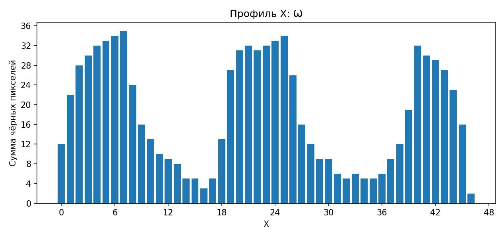

### Профиль Y

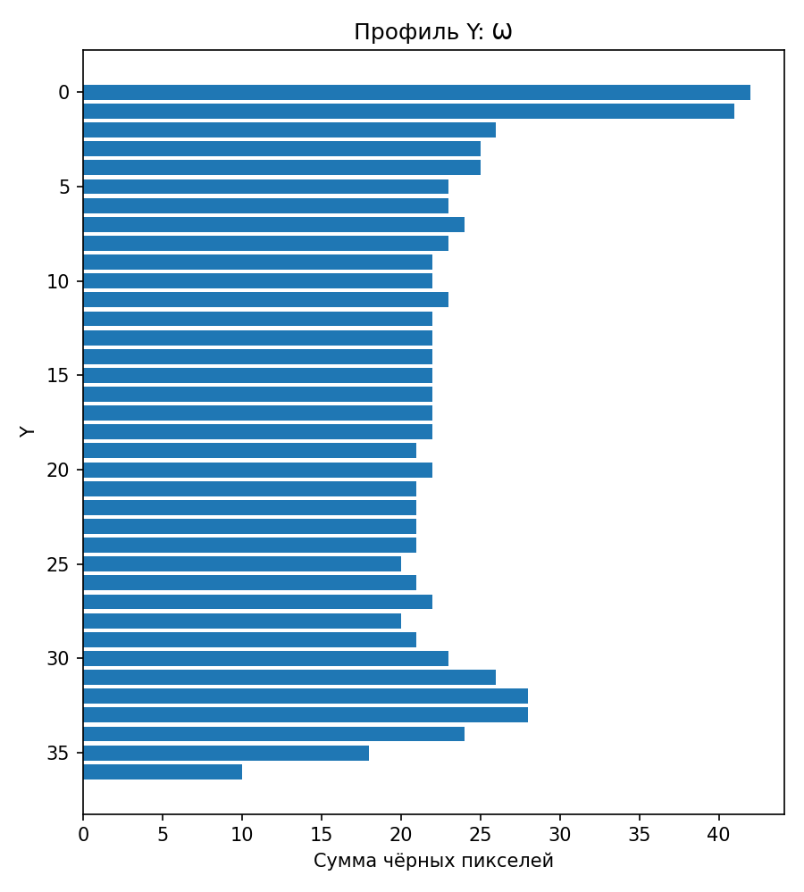

---
## Символ 37 — Ѳ

### Изображение символа

### Скалярные характеристики

| Признак | Значение |
|---|---:|
| Ширина изображения | 31 |
| Высота изображения | 38 |
| Общий вес чёрного | 569 |
| Общий удельный вес | 0.483022 |
| Вес 1-й четверти | 142 |
| Вес 2-й четверти | 152 |
| Вес 3-й четверти | 132 |
| Вес 4-й четверти | 143 |
| Удельный вес 1-й четверти | 0.498246 |
| Удельный вес 2-й четверти | 0.500000 |
| Удельный вес 3-й четверти | 0.463158 |
| Удельный вес 4-й четверти | 0.470395 |
| Координата центра тяжести X | 15.309315 |
| Координата центра тяжести Y | 18.323374 |
| Нормированная координата X | 0.510310 |
| Нормированная координата Y | 0.495226 |
| Осевой момент инерции Ix | 51926.499121 |
| Осевой момент инерции Iy | 50185.560633 |
| Нормированный момент инерции Ix | 0.037420 |
| Нормированный момент инерции Iy | 0.036165 |

### Профиль X

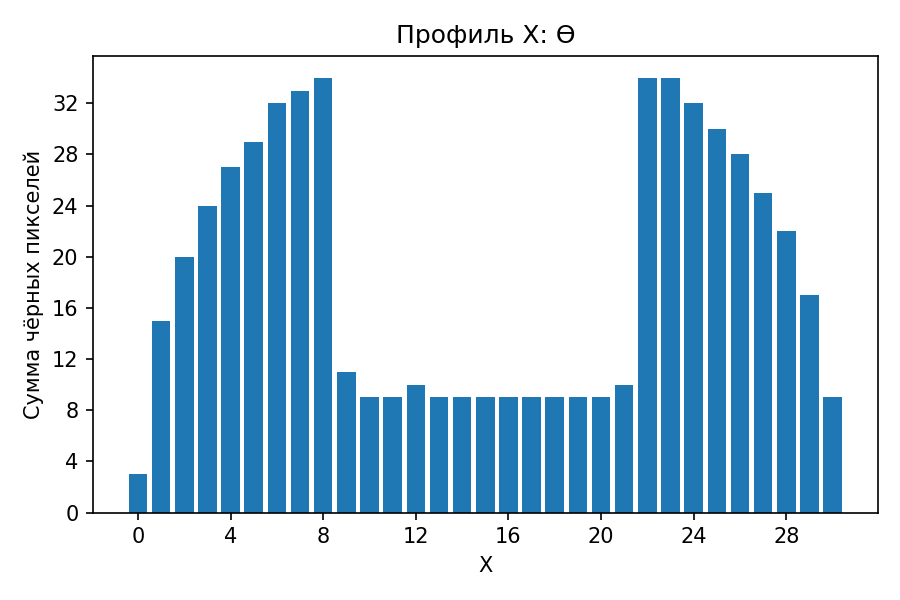

### Профиль Y

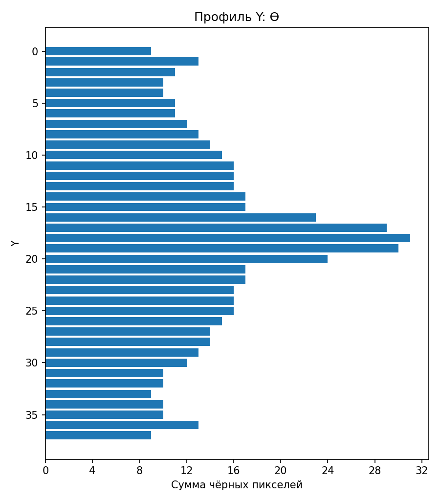

---
## Символ 38 — Ѧ

### Изображение символа

### Скалярные характеристики

| Признак | Значение |
|---|---:|
| Ширина изображения | 42 |
| Высота изображения | 36 |
| Общий вес чёрного | 668 |
| Общий удельный вес | 0.441799 |
| Вес 1-й четверти | 66 |
| Вес 2-й четверти | 143 |
| Вес 3-й четверти | 225 |
| Вес 4-й четверти | 234 |
| Удельный вес 1-й четверти | 0.174603 |
| Удельный вес 2-й четверти | 0.378307 |
| Удельный вес 3-й четверти | 0.595238 |
| Удельный вес 4-й четверти | 0.619048 |
| Координата центра тяжести X | 21.666168 |
| Координата центра тяжести Y | 21.288922 |
| Нормированная координата X | 0.528443 |
| Нормированная координата Y | 0.608255 |
| Осевой момент инерции Ix | 68151.238024 |
| Осевой момент инерции Iy | 71592.555389 |
| Нормированный момент инерции Ix | 0.029811 |
| Нормированный момент инерции Iy | 0.031316 |

### Профиль X

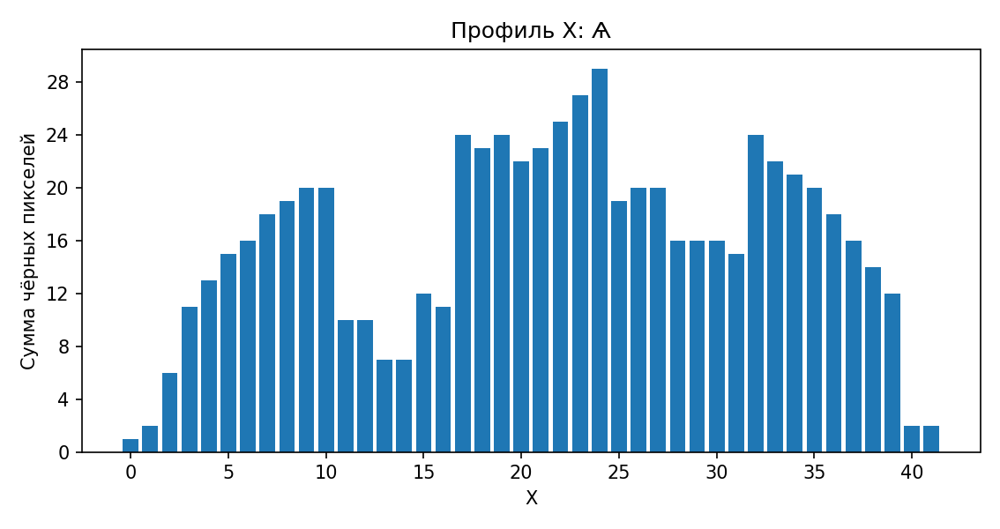

### Профиль Y

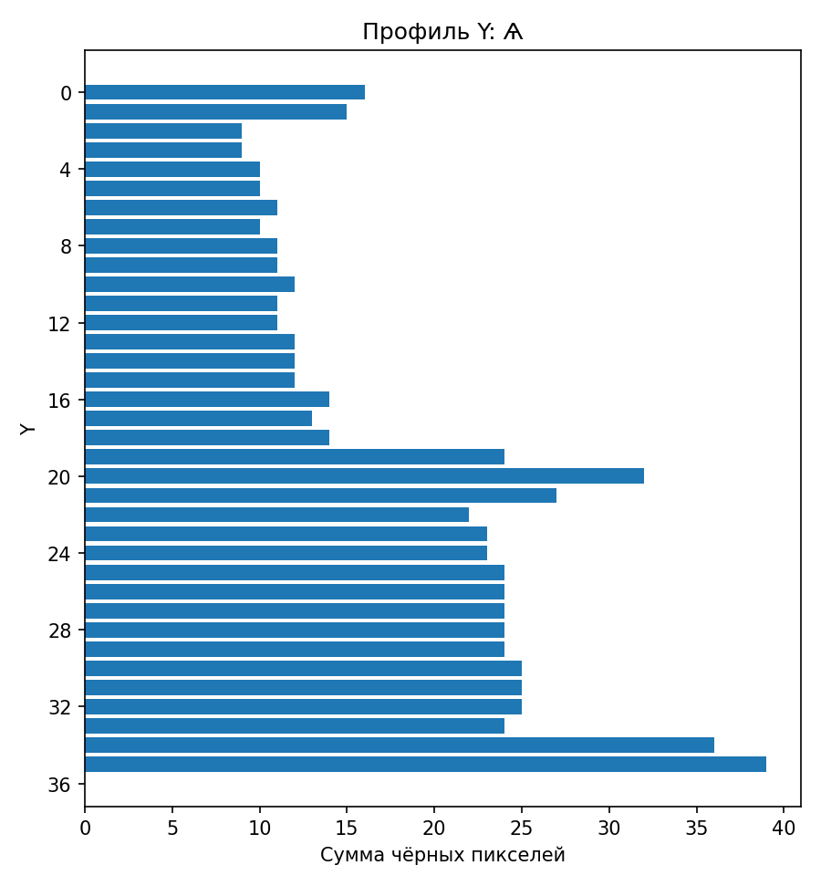

---
## Символ 39 — Ѫ

### Изображение символа

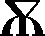

### Скалярные характеристики

| Признак | Значение |
|---|---:|
| Ширина изображения | 45 |
| Высота изображения | 36 |
| Общий вес чёрного | 666 |
| Общий удельный вес | 0.411111 |
| Вес 1-й четверти | 163 |
| Вес 2-й четверти | 99 |
| Вес 3-й четверти | 194 |
| Вес 4-й четверти | 210 |
| Удельный вес 1-й четверти | 0.411616 |
| Удельный вес 2-й четверти | 0.239130 |
| Удельный вес 3-й четверти | 0.489899 |
| Удельный вес 4-й четверти | 0.507246 |
| Координата центра тяжести X | 21.168168 |
| Координата центра тяжести Y | 19.623123 |
| Нормированная координата X | 0.481095 |
| Нормированная координата Y | 0.560661 |
| Осевой момент инерции Ix | 86276.403904 |
| Осевой момент инерции Iy | 82249.165165 |
| Нормированный момент инерции Ix | 0.032875 |
| Нормированный момент инерции Iy | 0.031340 |

### Профиль X

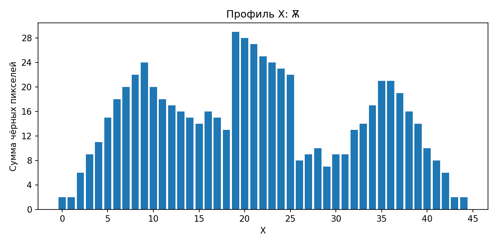

### Профиль Y

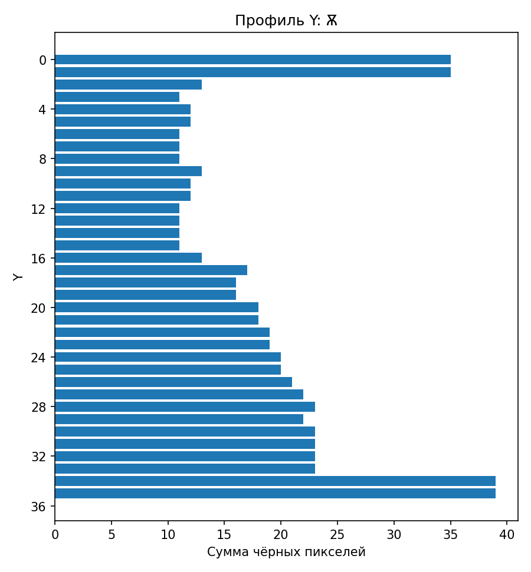

---
