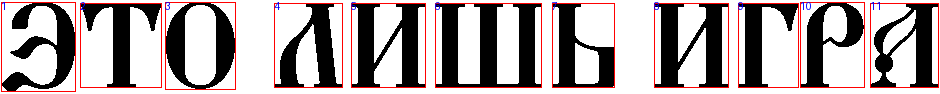
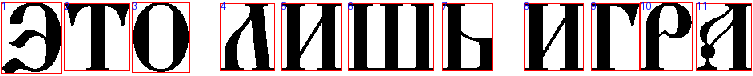

# Лабораторная работа №7. Классификация на основе признаков, анализ профилей

**Алфавит:** кириллица заглавная  
**Эксперимент:** сравнение классификации до и после добавления профилей X/Y  

---

## Использованные методы

В работе выполнены два варианта распознавания:

1. **Без профилей** — используются только скалярные признаки: удельная масса чёрного, нормированные координаты центра тяжести, нормированные осевые моменты инерции Ix и Iy.
2. **С профилями X/Y** — к скалярным признакам добавляются нормированные профили X и Y, приведённые к фиксированной длине.

Мера близости рассчитывается через евклидово расстояние в пространстве нормализованных признаков:

$$
S = \frac{1}{1 + d}
$$

Для эксперимента автоматически создан файл `phrase_alt.bmp`: исходное изображение уменьшено в 0.8 раза.

---

## Подготовка эталонов

Эталонов загружено: **39**.

Размерность признаков без профилей: **5**.

Размерность признаков с профилями: **45**.

Алфавит эталонов:

`АБВГДЕЖЅЗИIКЛМНОПРСТѸФХЦЧШЩЪЫЬѢЮѴѮѰѠѲѦѪ`

---

## 1. Распознавание: основное изображение, без профилей

**Файл:** `phrase.bmp`  
**Режим:** `without_profiles`  
**Размерность признакового вектора:** `5`

### Исходное изображение

### Сегментация символов

### Результат распознавания

- Эталонная строка: `ЭТОЛИШЬИГРА`
- Распознанная строка: `ЗТОЛѲЮЬПГРА`
- Совпадений по позициям: **7 из 11**
- Количество ошибок по Левенштейну: **4**
- Доля верно распознанных символов: **63.64%**

Полный список гипотез сохранён в файл: `./result/phrase/without_profiles/hypotheses_phrase_without_profiles.txt`.

### Лучшие гипотезы по символам

| № | Лучшая гипотеза | Мера близости | Первые 5 гипотез |
|---:|:---:|---:|---|
| 1 | `З` | 0.8878 | З: 0.8878, Ѕ: 0.8703, Ъ: 0.8675, Ѣ: 0.8258, А: 0.7696 |
| 2 | `Т` | 0.9408 | Т: 0.9408, Ц: 0.7449, Ѱ: 0.7105, Ѹ: 0.6992, Ѵ: 0.6893 |
| 3 | `О` | 0.9054 | О: 0.9054, Ж: 0.8511, Ѳ: 0.8485, Ф: 0.8187, С: 0.8117 |
| 4 | `Л` | 0.8979 | Л: 0.8979, Ѣ: 0.8361, Ѕ: 0.8251, Ъ: 0.8056, Ѯ: 0.7825 |
| 5 | `Ѳ` | 0.8845 | Ѳ: 0.8845, Ф: 0.8806, О: 0.8736, Ж: 0.8538, К: 0.8440 |
| 6 | `Ю` | 0.8787 | Ю: 0.8787, Ы: 0.8247, Ѡ: 0.8199, Ш: 0.8192, М: 0.7841 |
| 7 | `Ь` | 0.8696 | Ь: 0.8696, Ѫ: 0.7964, С: 0.7278, Е: 0.7233, Ѧ: 0.6982 |
| 8 | `П` | 0.8765 | П: 0.8765, Ф: 0.8703, Ѳ: 0.8596, К: 0.8438, О: 0.8436 |
| 9 | `Г` | 0.8890 | Г: 0.8890, Ѵ: 0.7153, Р: 0.6871, Ѹ: 0.6367, Ѱ: 0.6340 |
| 10 | `Р` | 0.8453 | Р: 0.8453, Ѵ: 0.8403, Ц: 0.8008, Ѱ: 0.8005, С: 0.7834 |
| 11 | `А` | 0.8722 | А: 0.8722, Ѕ: 0.8661, Ъ: 0.8550, З: 0.8363, Ѣ: 0.7981 |

---

## 2. Распознавание: основное изображение, с профилями X/Y

**Файл:** `phrase.bmp`  
**Режим:** `with_profiles`  
**Размерность признакового вектора:** `45`

### Исходное изображение

### Сегментация символов

### Результат распознавания

- Эталонная строка: `ЭТОЛИШЬИГРА`
- Распознанная строка: `ЗТОЛНШЬНГРА`
- Совпадений по позициям: **8 из 11**
- Количество ошибок по Левенштейну: **3**
- Доля верно распознанных символов: **72.73%**

Полный список гипотез сохранён в файл: `./result/phrase/with_profiles/hypotheses_phrase_with_profiles.txt`.

### Лучшие гипотезы по символам

| № | Лучшая гипотеза | Мера близости | Первые 5 гипотез |
|---:|:---:|---:|---|
| 1 | `З` | 0.4202 | З: 0.4202, Ѕ: 0.3947, Ѯ: 0.3450, Ѳ: 0.3235, Р: 0.3137 |
| 2 | `Т` | 0.8137 | Т: 0.8137, Ъ: 0.3333, Ж: 0.3006, Щ: 0.2965, Д: 0.2947 |
| 3 | `О` | 0.5572 | О: 0.5572, С: 0.3818, Ѳ: 0.3694, Н: 0.3364, И: 0.3360 |
| 4 | `Л` | 0.6781 | Л: 0.6781, А: 0.4193, К: 0.3523, Ѧ: 0.3470, Ѯ: 0.3458 |
| 5 | `Н` | 0.4603 | Н: 0.4603, И: 0.4597, П: 0.4350, А: 0.4063, К: 0.4010 |
| 6 | `Ш` | 0.4543 | Ш: 0.4543, Ѡ: 0.3975, М: 0.3653, Ж: 0.3600, Щ: 0.3527 |
| 7 | `Ь` | 0.4866 | Ь: 0.4866, Б: 0.3774, В: 0.3364, Р: 0.3255, П: 0.3231 |
| 8 | `Н` | 0.4962 | Н: 0.4962, И: 0.4948, П: 0.4600, К: 0.4041, А: 0.3892 |
| 9 | `Г` | 0.5984 | Г: 0.5984, Ѵ: 0.3352, Р: 0.3306, Ь: 0.3224, Б: 0.3185 |
| 10 | `Р` | 0.5691 | Р: 0.5691, Ѵ: 0.3557, Ѳ: 0.3437, К: 0.3277, Г: 0.3250 |
| 11 | `А` | 0.6844 | А: 0.6844, Ч: 0.4156, Л: 0.3927, Ѯ: 0.3524, П: 0.3504 |

---

## 3. Распознавание: уменьшенное изображение phrase_alt.bmp, без профилей

**Файл:** `phrase_alt.bmp`  
**Режим:** `without_profiles`  
**Размерность признакового вектора:** `5`

### Исходное изображение

### Сегментация символов

### Результат распознавания

- Эталонная строка: `ЭТОЛИШЬИГРА`
- Распознанная строка: `ЗТОЛѲЮЬПГѴЅ`
- Совпадений по позициям: **5 из 11**
- Количество ошибок по Левенштейну: **6**
- Доля верно распознанных символов: **45.45%**

Полный список гипотез сохранён в файл: `./result/phrase_alt/without_profiles/hypotheses_phrase_alt_without_profiles.txt`.

### Лучшие гипотезы по символам

| № | Лучшая гипотеза | Мера близости | Первые 5 гипотез |
|---:|:---:|---:|---|
| 1 | `З` | 0.8951 | З: 0.8951, Ѕ: 0.8720, Ъ: 0.8678, Ѣ: 0.8290, А: 0.7724 |
| 2 | `Т` | 0.9215 | Т: 0.9215, Ц: 0.7462, Ѱ: 0.7068, Х: 0.6903, Ѹ: 0.6887 |
| 3 | `О` | 0.9089 | О: 0.9089, Ѳ: 0.8551, Ж: 0.8527, Ф: 0.8235, С: 0.8127 |
| 4 | `Л` | 0.8900 | Л: 0.8900, Ѣ: 0.8458, Ѕ: 0.8359, Ъ: 0.8143, Ѯ: 0.7884 |
| 5 | `Ѳ` | 0.8883 | Ѳ: 0.8883, Ф: 0.8837, О: 0.8776, Ж: 0.8564, К: 0.8470 |
| 6 | `Ю` | 0.8663 | Ю: 0.8663, Ы: 0.8186, Ш: 0.8166, Ѡ: 0.8109, М: 0.7797 |
| 7 | `Ь` | 0.8680 | Ь: 0.8680, Ѫ: 0.8057, С: 0.7312, Е: 0.7252, Ѧ: 0.7045 |
| 8 | `П` | 0.8696 | П: 0.8696, Ф: 0.8552, К: 0.8522, Н: 0.8421, И: 0.8391 |
| 9 | `Г` | 0.8732 | Г: 0.8732, Ѵ: 0.7279, Р: 0.6846, Ѹ: 0.6494, Ѱ: 0.6405 |
| 10 | `Ѵ` | 0.8445 | Ѵ: 0.8445, Р: 0.8395, Ѱ: 0.8094, Ц: 0.8027, С: 0.7846 |
| 11 | `Ѕ` | 0.8742 | Ѕ: 0.8742, Ъ: 0.8611, З: 0.8570, А: 0.8534, Ѣ: 0.8096 |

---

## 4. Распознавание: уменьшенное изображение phrase_alt.bmp, с профилями X/Y

**Файл:** `phrase_alt.bmp`  
**Режим:** `with_profiles`  
**Размерность признакового вектора:** `45`

### Исходное изображение

### Сегментация символов

### Результат распознавания

- Эталонная строка: `ЭТОЛИШЬИГРА`
- Распознанная строка: `ЗТОЛИШЬНГРА`
- Совпадений по позициям: **9 из 11**
- Количество ошибок по Левенштейну: **2**
- Доля верно распознанных символов: **81.82%**

Полный список гипотез сохранён в файл: `./result/phrase_alt/with_profiles/hypotheses_phrase_alt_with_profiles.txt`.

### Лучшие гипотезы по символам

| № | Лучшая гипотеза | Мера близости | Первые 5 гипотез |
|---:|:---:|---:|---|
| 1 | `З` | 0.4287 | З: 0.4287, Ѕ: 0.4085, Ѯ: 0.3629, Ѳ: 0.3386, Р: 0.3193 |
| 2 | `Т` | 0.7629 | Т: 0.7629, Ъ: 0.3383, Ж: 0.3023, Д: 0.3020, Щ: 0.2988 |
| 3 | `О` | 0.5316 | О: 0.5316, Ѳ: 0.3826, С: 0.3811, Н: 0.3358, И: 0.3352 |
| 4 | `Л` | 0.6450 | Л: 0.6450, А: 0.4321, К: 0.3528, Ѧ: 0.3478, Ѯ: 0.3472 |
| 5 | `И` | 0.4466 | И: 0.4466, Н: 0.4462, П: 0.4270, А: 0.4257, К: 0.4171 |
| 6 | `Ш` | 0.4385 | Ш: 0.4385, Ѡ: 0.3547, Ы: 0.3521, Щ: 0.3407, Ж: 0.3243 |
| 7 | `Ь` | 0.5314 | Ь: 0.5314, Б: 0.3924, В: 0.3454, Р: 0.3283, Г: 0.3210 |
| 8 | `Н` | 0.4604 | Н: 0.4604, И: 0.4592, П: 0.4207, К: 0.3809, А: 0.3789 |
| 9 | `Г` | 0.6111 | Г: 0.6111, Ѵ: 0.3401, Р: 0.3277, Ь: 0.3203, Б: 0.3167 |
| 10 | `Р` | 0.5787 | Р: 0.5787, Ѵ: 0.3587, Ѳ: 0.3445, К: 0.3300, П: 0.3241 |
| 11 | `А` | 0.6667 | А: 0.6667, Ч: 0.4218, Л: 0.3906, Ѯ: 0.3496, П: 0.3485 |

---

## Сводное сравнение

| Изображение | Режим | Распознанная строка | Ошибки | Точность |
|---|---|---|---:|---:|
| `phrase.bmp` | без профилей | `ЗТОЛѲЮЬПГРА` | 4 | 63.64% |
| `phrase.bmp` | с профилями | `ЗТОЛНШЬНГРА` | 3 | 72.73% |
| `phrase_alt.bmp` | без профилей | `ЗТОЛѲЮЬПГѴЅ` | 6 | 45.45% |
| `phrase_alt.bmp` | с профилями | `ЗТОЛИШЬНГРА` | 2 | 81.82% |

---

## Вывод

В ходе работы были выполнены два варианта классификации: только по скалярным признакам и по расширенному набору признаков с профилями X/Y. Добавление профилей позволяет учитывать форму символа, поэтому похожие по массе и моментам буквы различаются лучше.
