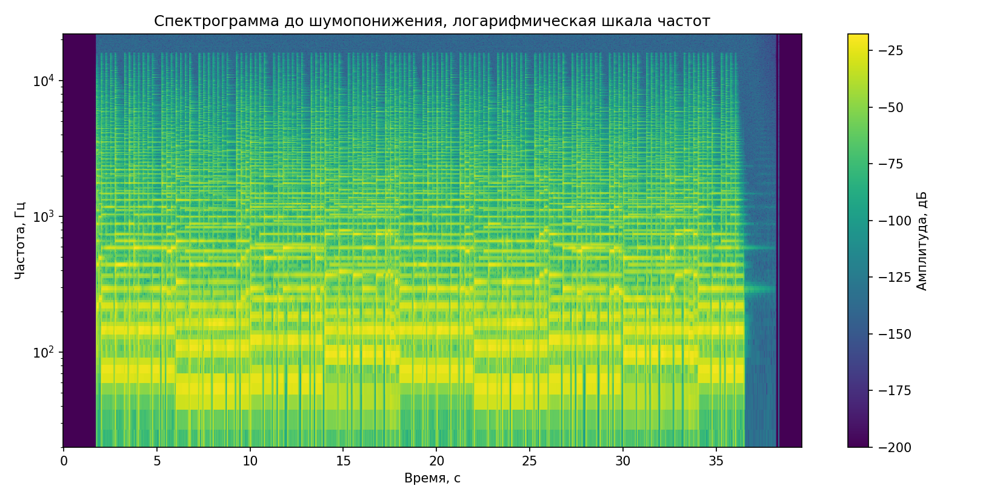
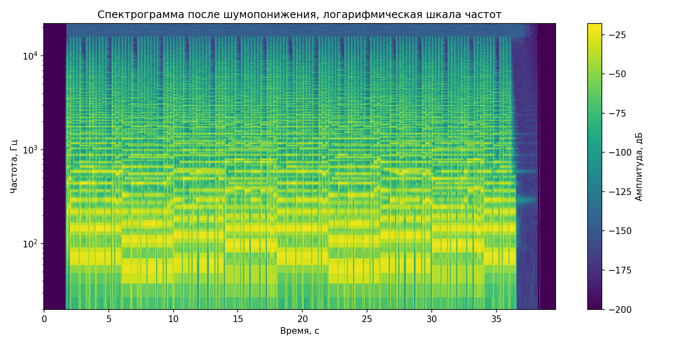
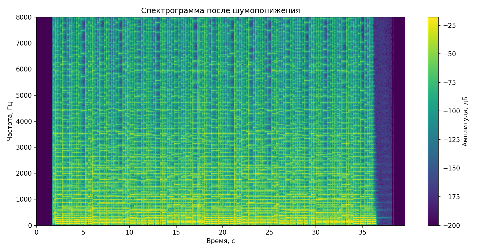
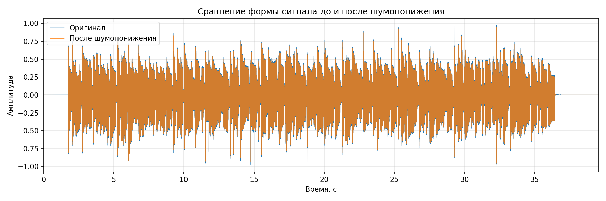
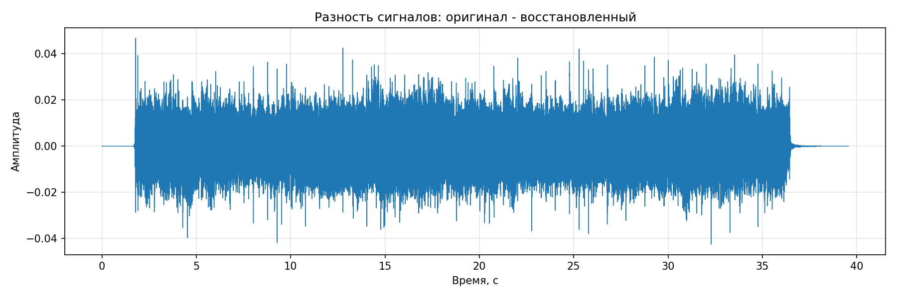
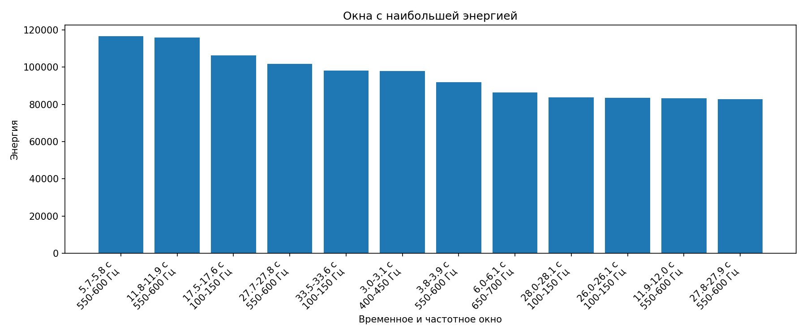

# Лабораторная работа №9. Анализ шума

## Исходные данные

- Входной файл: `input.wav`
- Частота дискретизации: **44100 Гц**
- Количество каналов в исходной дорожке: **2**
- Исходный тип данных WAV: `int16`
- Длительность: **39.56 с**
---

## 1. Спектрограмма исходного сигнала

Спектрограмма построена с помощью оконного преобразования Фурье STFT с окном Ханна. Частотная ось дополнительно визуализирована в логарифмическом масштабе.

Линейная версия спектрограммы:

---

## 2. Оценка и вычитание шума

Для оценки шума были использованы самые тихие STFT-кадры: нижние **15%** по энергии. Затем выполнено спектральное вычитание по формуле:

$$
Y(f,t)=\max(X(f,t)-kW(f,t),\ \alpha X(f,t))
$$

где `k = 1.4`, `alpha = 0.03`.

После вычитания шума сигнал был восстановлен обратным STFT и сохранён в файл:

- [`denoised.wav`](./result/denoised.wav)

Дополнительно сохранён вариант с фильтром Винера:

- [`denoised_wiener.wav`](./result/denoised_wiener.wav)

---

## 3. Сравнение спектрограмм до и после шумопонижения

### После спектрального вычитания

Линейная версия:

---

## 4. Сравнение восстановленного файла с оригиналом

Ниже показаны формы сигналов до и после обработки.

Разностный сигнал показывает, какая часть была удалена или изменена в результате шумопонижения.

| Метрика | Значение |
|---|---:|
| RMS исходного сигнала | 0.175407 |
| Оценка RMS шума | 0.000426 |
| Оценка SNR | 52.29 дБ |
| RMS разности original - denoised | 0.006926 |
| Доля разности относительно исходного RMS | 0.0395 |

---

## 5. Моменты времени с наибольшей энергией

По условию использованы окна: `Δt = 0.1 c`, `Δf = 50 Гц`.

| № | Время, с | Частоты, Гц | Энергия |
|---:|---:|---:|---:|
| 1 | 5.70–5.80 | 550–600 | 1.1674e+05 |
| 2 | 11.80–11.90 | 550–600 | 1.1583e+05 |
| 3 | 17.50–17.60 | 100–150 | 1.0639e+05 |
| 4 | 27.70–27.80 | 550–600 | 1.0180e+05 |
| 5 | 33.50–33.60 | 100–150 | 9.8266e+04 |
| 6 | 3.00–3.10 | 400–450 | 9.7823e+04 |
| 7 | 3.80–3.90 | 550–600 | 9.1883e+04 |
| 8 | 6.00–6.10 | 650–700 | 8.6389e+04 |
| 9 | 28.00–28.10 | 100–150 | 8.3776e+04 |
| 10 | 26.00–26.10 | 100–150 | 8.3420e+04 |
| 11 | 11.90–12.00 | 550–600 | 8.3189e+04 |
| 12 | 27.80–27.90 | 550–600 | 8.2702e+04 |

Полная таблица сохранена в CSV:

- [`energy_maxima.csv`](./result/energy_maxima.csv)

---

## Вывод

В работе была построена спектрограмма исходного аудиосигнала, выполнена оценка шума по тихим участкам записи и применено спектральное вычитание. Восстановленный звуковой файл сохранён отдельно и сравнен с оригиналом по форме сигнала, разностному сигналу и численным метрикам. Также найдены временно-частотные окна с максимальной энергией.
